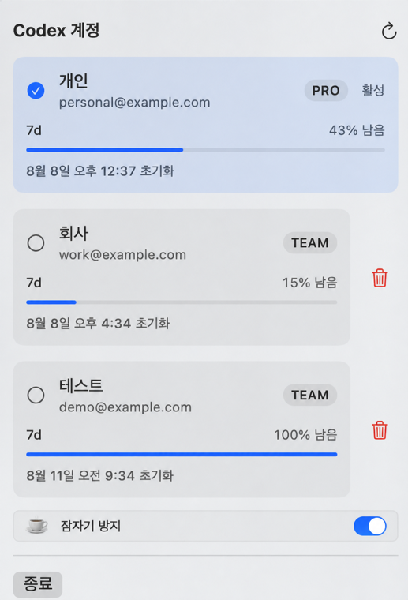

# Codex Account Switcher for macOS

Codex Account Switcher는 개인·회사 Codex 계정 전환과 계정별 사용 한도 조회를 제공하는 macOS 메뉴바 앱이다.

<p align="center">
  
</p>

<p align="center"><sub>가상 데이터 예시다. 현재 앱은 초기화 시각 뒤에 남은 시간도 표시한다.</sub></p>

## 기능

- 최대 3개 ChatGPT 계정 등록·전환
- 공식 Codex 정상 종료 → 인증 교체 → 대상 검증 → 재실행 자동 처리
- 계정별 plan, 남은 한도, 초기화 시각·카운트다운 표시
- 비활성 계정 삭제·재등록과 만료 계정 재로그인
- 전환 실패 시 이전 계정 자동 롤백, 복구 실패 시 수동 복구
- Mac 덮개를 닫아도 작업을 유지하는 잠자기 방지

계정별 task·history·설정은 분리하지 않고 하나의 `~/.codex`를 공유한다.

## 설치

> **배포 상태:** 원격 설치는 GitHub `v0.1.0` 태그 게시 후 사용할 수 있다.

필요 환경:

- macOS 13 Ventura 이상
- 공식 Codex 앱
- Xcode Command Line Tools 또는 Xcode

설치는 고정 릴리스 태그의 [bootstrap 스크립트](https://github.com/aqwsde321/codex-account-switcher-macos/blob/v0.1.0/Scripts/install-remote.sh)를 사용한다.

```sh
(set -o pipefail && curl -fsSL https://raw.githubusercontent.com/aqwsde321/codex-account-switcher-macos/v0.1.0/Scripts/install-remote.sh | /bin/zsh)
```

고정된 `v0.1.0` 소스를 임시 폴더에 받아 로컬에서 빌드하고 `~/Applications`에 설치한다. `sudo`는 사용하지 않는다. 설치 후 앱을 실행하고 로그인 시 자동 시작한다.

## 사용

### 첫 계정 등록

<p align="center">
  
</p>

<p align="center"><sub>가상 데이터 GIF: 등록 시작 → 이름 입력 → 자동 종료·등록 승인 → 활성 계정 등록.</sub></p>

1. 공식 Codex에 사용할 첫 계정으로 로그인한다.
2. 메뉴바 앱에서 `계정 등록`을 누른다.
3. 라벨을 입력하고 `현재 로그인 등록`을 선택한다.
4. 등록을 승인하면 앱이 Codex 종료·저장·재실행을 자동 처리한다.

### 계정 추가

<p align="center">
  
</p>

<p align="center"><sub>가상 데이터 GIF: 추가 시작 → 이름 입력 → 브라우저 로그인 → 비활성 계정 저장.</sub></p>

1. `계정 등록`에서 라벨을 입력하고 `새 계정 등록`을 선택한다.
2. 열린 브라우저에서 추가할 계정으로 로그인한다.
3. 새 계정은 비활성으로 저장되고 현재 활성 계정은 유지된다.

추가 등록은 공식 Codex의 현재 로그인과 활성 프로필을 변경하지 않는다.

### 계정 전환

<p align="center">
  
</p>

<p align="center"><sub>가상 데이터 GIF: 대상 선택 → 한 번 승인 → 자동 검증 → 활성 계정 변경.</sub></p>

1. 전환할 계정 카드를 선택한다.
2. 확인창에서 `전환`을 한 번 승인한다.
3. 이후 Codex 종료·인증 교체·검증·재실행은 자동이다.

독립 Codex CLI나 IDE 작업이 실행 중이면 인증 보호를 위해 전환을 차단한다. 해당 작업을 직접 종료한 뒤 다시 시도한다.

공식 앱 프로세스가 정상 종료 후에도 남은 예외 상황에서만 별도 `SIGTERM 전송` 승인을 요청한다. 자동 강제 종료는 하지 않는다.

### 한도와 잠자기 방지

- 카드와 메뉴바에서 활성 계정의 최소 잔여율과 초기화까지 남은 시간을 확인한다.
- 남은 시간은 올림한다. 예: `2일 19시간` → `3d`.
- 자동 조회는 활성 계정 2분, 전체 계정 30분 주기다.
- `잠자기 방지`는 관리자 인증 후 macOS 시스템 설정을 바꾸며 앱을 종료해도 유지될 수 있다.

### 계정 삭제

비활성 계정 카드의 휴지통을 누르면 해당 프로필과 저장 인증만 삭제한다. 활성 계정은 삭제할 수 없다.

## 제거

```sh
(set -o pipefail && curl -fsSL https://raw.githubusercontent.com/aqwsde321/codex-account-switcher-macos/v0.1.0/Scripts/install-remote.sh | /bin/zsh -s -- --uninstall)
```

앱과 자동 시작 항목만 제거한다. 저장 계정, 로그, 잠자기 방지 설정은 보존한다.

## 데이터와 제한

- 계정 목록: `~/Library/Application Support/CodexAccountSwitcher/profiles.json`
- 계정별 인증: `~/Library/Application Support/CodexAccountSwitcher/credentials/`
- 현재 활성 인증: `~/.codex/auth.json`
- 저장 인증은 Keychain 암호화가 아니며 같은 macOS 사용자 권한의 다른 프로세스가 읽을 수 있다.
- 실제 인증값은 저장소, 로그, screenshot에 포함하지 않는다.

자세한 내용은 [보안 문서](docs/SECURITY.md)를 따른다.

<details>
<summary>개발자용 문서</summary>

소스 수정·테스트·로컬 설치는 [개발 문서](docs/DEVELOPMENT.md)를 따른다.

</details>
