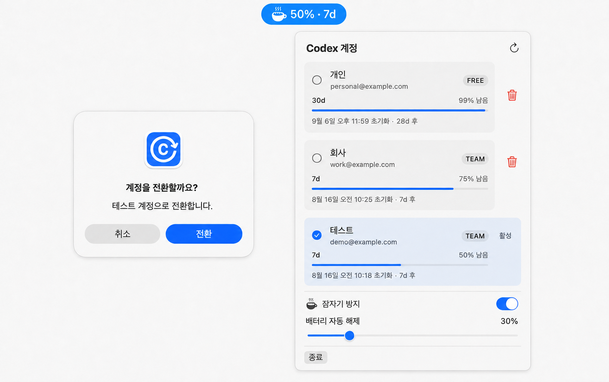
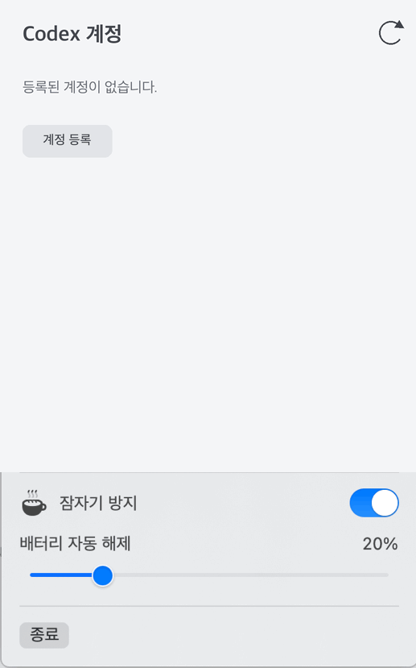
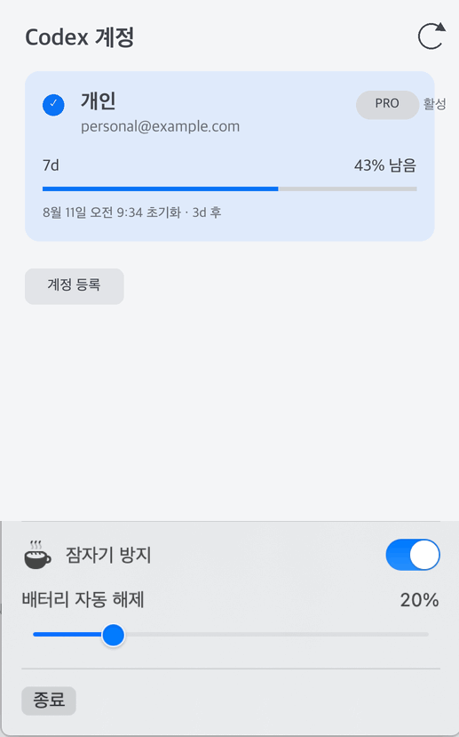
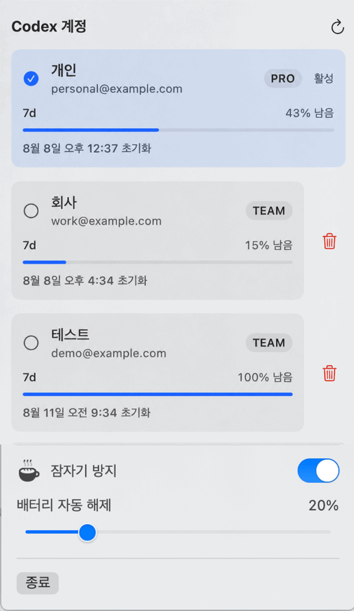

# Codex Account Switcher for macOS

Codex Account Switcher는 macOS용 Codex 데스크톱 앱 계정을 메뉴바에서 전환하고 계정별 사용 한도를 보여준다. 전환 결과는 같은 `~/.codex` 인증을 사용하는 Codex CLI에도 적용된다.

**계정 전환을 한 번 승인하면 Codex 앱 정상 종료 → 인증 교체 → 대상 검증 → 앱 재실행을 자동 처리한다.** 실행 중인 CLI·IDE 작업은 인증 보호를 위해 전환 전에 종료해야 한다.

<p align="center">
  
</p>

<p align="center"><sub>가상 상태 예시. 잠자기 방지가 켜지면 채운 커피잔 위로 김 세 줄이 오르고, 꺼지면 빈 커피잔을 표시한다.</sub></p>

<p align="center">
  
</p>

<p align="center"><sub>가상 데이터 예시: 메뉴바 상태 확인 → 대상 계정 선택 → 전환 승인.</sub></p>

## 기능

- 최대 3개 ChatGPT 계정 등록·전환
- Codex 데스크톱 앱 정상 종료 → 인증 교체 → 대상 검증 → 재실행 자동 처리
- 같은 `~/.codex` 인증을 사용하는 Codex CLI에도 전환 결과 적용
- 계정별 plan, 남은 한도, 초기화 시각·카운트다운 표시
- 계정별 수동 `⚡` 토큰 사용과 `resetsAt` 기반 자동 토큰 사용
- 비활성 계정 삭제·재등록과 만료 계정 재로그인
- 전환 실패 시 이전 계정 자동 롤백, 복구 실패 시 수동 복구
- Mac 덮개를 닫아도 작업을 유지하는 잠자기 방지와 배터리 임계값 자동 해제

계정별 task·history·설정은 분리하지 않고 하나의 `~/.codex`를 공유한다.

## 설치

이 문서는 현재 소스 기준이다. [변경 이력의 `배포 예정`](CHANGELOG.md)에 있는 개선은 아래 `v0.3.2` 설치 명령에 아직 포함되지 않는다. 해당 개선을 사용하려면 [소스 설치 절차](docs/DEVELOPMENT.md#개발-환경-시작)를 따른다.

필요 환경:

- macOS 13 Ventura 이상
- 공식 Codex 앱
- Xcode Command Line Tools 또는 Xcode

설치는 고정 릴리스 태그의 [bootstrap 스크립트](https://github.com/aqwsde321/codex-account-switcher-macos/blob/v0.3.2/Scripts/install-remote.sh)를 사용한다.

```sh
(set -o pipefail && curl -fsSL https://raw.githubusercontent.com/aqwsde321/codex-account-switcher-macos/v0.3.2/Scripts/install-remote.sh | /bin/zsh)
```

고정된 `v0.3.2` 소스를 임시 폴더에 받아 로컬에서 빌드하고 `~/Applications`에 설치한다. 배터리 자동 해제용 시스템 서비스 설치 때문에 관리자 암호를 한 번 요청한다. 설치 후 앱과 시스템 서비스가 자동 시작한다.

## 사용

### 첫 계정 등록

<p align="center">
  
</p>

<p align="center"><sub>가상 데이터 GIF: 등록 시작 → 이름 입력 → 자동 종료·등록 승인 → 활성 계정 등록.</sub></p>

1. 공식 Codex에 사용할 첫 계정으로 로그인한다.
2. 메뉴바 앱에서 `계정 등록`을 누른다.
3. 라벨을 입력하고 `현재 로그인 등록`을 선택한다.
4. 등록을 승인하면 앱이 Codex 종료·저장·재실행을 자동 처리한다.

### 계정 추가

<p align="center">
  
</p>

<p align="center"><sub>가상 데이터 GIF: 추가 시작 → 이름 입력 → 브라우저 로그인 → 비활성 계정 저장.</sub></p>

1. `계정 등록`에서 라벨을 입력하고 `새 계정 등록`을 선택한다.
2. 열린 브라우저에서 추가할 계정으로 로그인한다.
3. 새 계정은 비활성으로 저장되고 현재 활성 계정은 유지된다.

메뉴에 현재 계정 확인부터 브라우저 로그인·새 계정 확인·저장까지 진행 상태를 표시한다. 브라우저가 자동으로 열리지 않으면 로그인 대기 중 `브라우저 다시 열기`를 누른다. `로그인 취소`로 중단할 수 있다.

추가 등록은 공식 Codex의 현재 로그인과 활성 프로필을 변경하지 않는다.

### 만료 계정 재로그인

재로그인이 필요한 비활성 계정을 선택하고 확인창에서 재로그인을 진행한다. 브라우저에서는 해당 계정으로 로그인해야 한다. 인증을 갱신한 계정은 비활성으로 유지되며, 전환하려면 다시 선택한다.

### 브라우저 로그인이 진행되지 않을 때

| 화면 상태 | 확인할 내용 |
|---|---|
| `현재 계정을 확인하는 중…` | 브라우저를 열기 전 현재 계정을 검증하는 단계다. 확인 실패나 시간 초과가 표시되면 네트워크와 Codex 로그인 상태를 확인하고 재시도한다. |
| `브라우저 로그인 페이지를 준비하는 중…` | 로그인 프로그램에서 주소를 받기를 기다리는 단계다. 아직 `브라우저 다시 열기` 버튼은 표시되지 않는다. |
| `브라우저에서 로그인을 완료하세요` | 브라우저가 보이지 않으면 `브라우저 다시 열기`를 누른다. 페이지를 열지 못했다는 오류가 뜨면 macOS 기본 브라우저 설정을 확인한다. |
| 현재 계정 인증이 변경되었다는 오류 | 계정 상태를 새로고침한 뒤 다시 시도한다. |
| 다른 계정 작업이 진행 중이라는 오류 | 해당 작업이 끝난 뒤 다시 시도한다. |
| 로그인 시간이 만료되었다는 오류 | 로그인 프로세스의 제한 시간은 10분이다. 다시 등록 또는 재로그인을 시작한다. |

`로그인 취소`를 누르면 대기 중인 로그인 주소가 폐기된다. 다시 시작할 때는 이전 오류를 지우고 새 로그인 상태를 표시한다. 종료가 확인된 이전 임시 작업은 자동 정리되며, 종료 여부가 불명확하면 복구 안내를 표시한다.

문제가 반복되면 [개발 문서의 로그인 진단 로그](docs/DEVELOPMENT.md#로그인-진단-로그)에서 실패 단계를 확인할 수 있다.

### 계정 전환

<p align="center">
  
</p>

<p align="center"><sub>가상 데이터 GIF: 대상 선택 → 한 번 승인 → Codex 정상 종료 → 인증 교체·대상 검증 → 앱 자동 재실행 → 활성 계정 변경.</sub></p>

1. 전환할 계정 카드를 선택한다.
2. 확인창에서 `전환`을 한 번 승인한다.
3. 이후 Codex 종료·인증 교체·검증·재실행은 자동이다.

독립 Codex CLI나 IDE 작업이 실행 중이면 인증 보호를 위해 전환을 차단한다. 해당 작업을 직접 종료한 뒤 다시 시도한다.

정상 종료 요청 후 약 1초가 지나도 종료 전에 확인한 동일 공식 앱 프로세스가 남은 경우에만 `SIGTERM 전송` 승인을 요청한다. 독립 CLI·IDE 프로세스는 종료하지 않고 전환을 차단한다.

### 한도·토큰 사용과 잠자기 방지

- 카드와 메뉴바에서 활성 계정의 최소 잔여율과 초기화까지 남은 시간을 확인한다.
- 남은 시간은 올림한다. 예: `2일 19시간` → `3d`.
- 자동 조회는 활성 계정 2분, 전체 계정 30분 주기다.
- 카드의 `⚡` 버튼은 해당 계정 credential을 격리된 `CODEX_HOME`에서 사용해 `codex exec`에 도구 사용 없는 짧은 자기소개를 요청한다. 요청 결과와 확인 가능한 입력·출력 토큰 수를 표시하고 해당 계정 한도를 다시 조회한다. 요청 성공만으로 사용량 반영이나 리셋 시각 확정을 보장하지 않는다.
- `자동 토큰 사용`은 기본 OFF다. 켜면 자동 조회와 수동 전체 새로고침 때 계정별 5시간·7일 창의 `resetsAt`을 분 단위로 정규화해 직전 조회값과 비교한다.
- 어느 계정에서든 분 단위 `resetsAt`이 이전보다 뒤로 이동하면 리셋으로 감지하고 전체 계정 한도를 다시 조회한다. 5시간 창의 남은 사용량이 `100%`인 계정의 `⚡`을 계정당 한 번씩 순차 실행하고, 실행 후 한도와 새 `resetsAt`을 다시 반영한다. 상태에는 감지된 계정·창과 이전·새 `resetsAt`을 표시한다.
- 수동 전체 새로고침에서 변경을 감지한 경우에는 방금 조회한 전체 결과를 재사용하며 전체 계정을 중복 조회하지 않는다.
- 첫 조회는 자동 실행하지 않고 기준값으로 사용한다. 자동 토큰 실행 실패 계정은 다음 자동 조회 때 다시 시도한다.
- `잠자기 방지`는 관리자 인증 후 macOS 시스템 설정을 바꾸며 앱을 종료해도 유지될 수 있다.
- 메뉴바와 설정 행의 커피잔은 잠자기 방지 OFF일 때 윤곽선, ON일 때 채움과 아래에서 위로 선명해지는 김 세 줄로 표시한다. macOS `동작 줄이기`가 켜져 있으면 정지한다.
- `배터리 자동 해제` Slider는 `0...99%`를 1% 단위로 선택한다. `0`은 끔이며 기본값은 `30%`다.
- 전원 어댑터가 분리된 상태에서 배터리가 임계값 이하가 되면 잠자기 방지를 끈다. 다시 켜지는 동작은 자동화하지 않는다.
- 60초 주기 조회는 사용하지 않는다. macOS 전원 소스 변경 알림과 서비스 시작 시점에만 상태를 확인한다.
- 자동 해제는 설치된 시스템 서비스가 실행하므로 매번 관리자 암호를 묻지 않는다.

### 계정 삭제

비활성 계정 카드의 휴지통을 누르면 해당 프로필과 저장 인증만 삭제한다. 활성 계정은 삭제할 수 없다.

## 제거

```sh
(set -o pipefail && curl -fsSL https://raw.githubusercontent.com/aqwsde321/codex-account-switcher-macos/v0.3.2/Scripts/install-remote.sh | /bin/zsh -s -- --uninstall)
```

앱, 자동 시작 항목, 배터리 자동 해제 시스템 서비스를 제거한다. 시스템 서비스 제거 때문에 관리자 암호를 요청할 수 있다. 저장 계정, 로그, 현재 잠자기 방지 설정은 보존한다.

## 데이터와 제한

- 계정 목록: `~/Library/Application Support/CodexAccountSwitcher/profiles.json`
- 계정별 인증: `~/Library/Application Support/CodexAccountSwitcher/credentials/`
- 토큰 사용용 작업 영역: `~/Library/Application Support/CodexAccountSwitcher/token-use-home/`
- 배터리 자동 해제 기준: `~/Library/Application Support/CodexAccountSwitcher/sleep-guard-threshold`
- 현재 활성 인증: `~/.codex/auth.json`
- 저장 인증은 Keychain 암호화가 아니며 같은 macOS 사용자 권한의 다른 프로세스가 읽을 수 있다.
- 실제 인증값은 저장소, 로그, screenshot에 포함하지 않는다.

자세한 변경 내용은 [변경 이력](CHANGELOG.md), 보안 제약은 [보안 문서](docs/SECURITY.md)를 따른다.

<details>
<summary>개발자용 문서</summary>

소스 수정·테스트·로컬 설치는 [개발 문서](docs/DEVELOPMENT.md)를 따른다.

</details>
