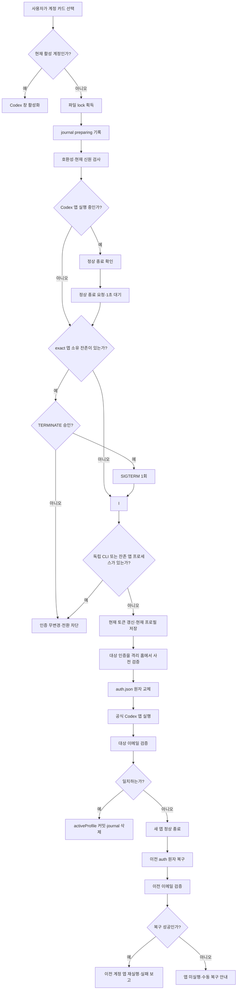
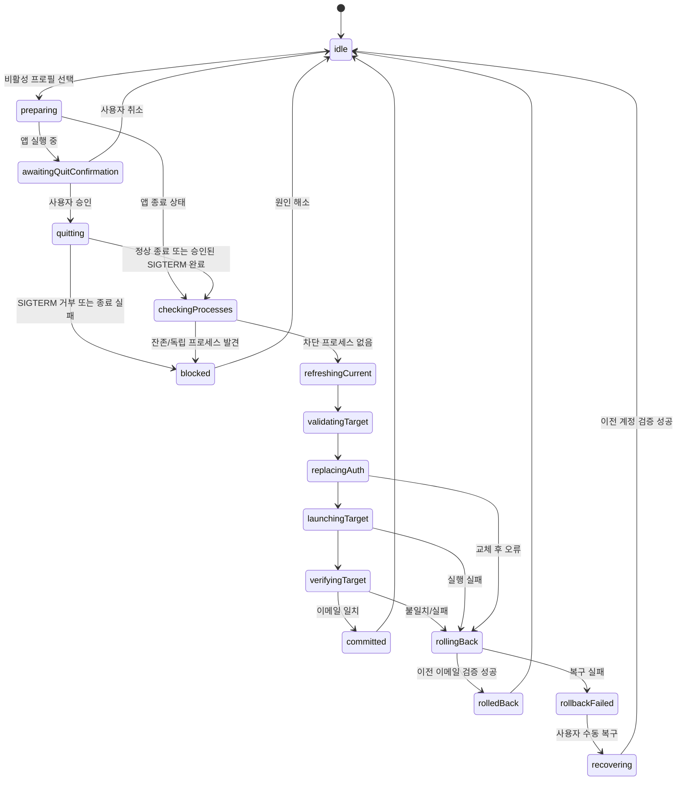

# Codex 계정 전환 기능 흐름

- 상태: Swift CLI Spike 완료, 메뉴바 등록·전환·복구·재로그인·비활성 계정 삭제 slice 완료
- 기준일: 2026-08-02
- 대상: macOS 공식 Codex 앱용 별도 메뉴바 helper
- 선행 단계: Swift CLI Spike

## 1. 기능 요약

### 목적

한 Mac의 기본 `~/.codex`를 최대 3개 계정이 공유하면서, 인증 파일만 계정별로 보관하고 안전하게 전환한다.

전환의 핵심 순서는 다음과 같다.

1. 공식 Codex 앱 정상 종료
2. 앱 소유 프로세스 종료 확인
3. 독립 Codex CLI/app-server 존재 여부 확인
4. 현재 계정의 갱신된 인증 저장
5. 대상 인증 검증 및 `~/.codex/auth.json` 원자 교체
6. 공식 앱 재실행
7. App Server가 보고하는 이메일 확인
8. 성공 커밋 또는 이전 계정으로 자동 롤백

### 제품 성격

이 제품은 편의용 계정 전환기다. 계정 사이의 로컬 데이터 격리를 제공하지 않는다.

공유되는 범위에는 대화·task, session, SQLite, history, 설정, skills, MCP 설정, worktree와 기타 `CODEX_HOME` 상태가 포함될 수 있다. 회사 정책상 개인 계정으로 회사 task 내용을 보내면 안 되는 환경에서는 이 제품을 사용하면 안 된다.

### 진입 조건

- macOS에 공식 `/Applications/ChatGPT.app` 또는 동일 bundle identifier의 앱이 설치돼 있다.
- MVP는 환경변수로 변경한 `CODEX_HOME`이 아니라 기본 `~/.codex`만 지원한다.
- 파일 기반 `auth.json`을 읽고 쓸 수 있다.
- ChatGPT 로그인 계정이며 App Server `account/read`가 이메일을 반환한다.
- 등록된 프로필은 최대 3개다.

### 완료 조건

- 대상 이메일이 App Server 응답과 일치한다.
- 실제 공식 앱에서 동일 task를 열 수 있다.
- 해당 task에 대상 계정으로 실제 메시지를 보내 응답을 받을 수 있다.
- Spike에서는 A→B→A 왕복을 3회 연속 성공해야 한다.

올바른 인증 전환이 확인됐는데도 account/task ownership 구조 때문에 동일 task를 다른 계정에서 재개할 수 없으면 Spike NO-GO다. Helper·verifier·process 구현 실패는 수정 후 전체 검증을 다시 수행한다. 내용을 복사해 새 task를 만드는 우회는 제품 요구를 충족하지 않는다.

## 2. 사용자 유형 및 분기 기준

### 사용자 유형

| 유형 | 설명 | 권한/책임 |
|---|---|---|
| 로컬 사용자 | 최대 3개 계정을 가진 Mac 사용자 | 계정 등록, 전환 승인, 실제 task 검증 |
| Helper | Swift CLI Spike 또는 메뉴바 앱 | 프로세스 게이트, 인증 교체, 검증, 롤백 |
| 공식 Codex 앱 | bundle id `com.openai.codex`인 데스크톱 앱 | task UI, 자체 app-server와 인증 사용 |
| 독립 Codex 프로세스 | Terminal·IDE 등에서 별도로 실행된 CLI/app-server | 자동 종료 대상이 아니며 전환 차단 원인 |
| 회사 관리자/정책 | 관리형 workspace 정책의 소유자 | 로그인 방식·workspace·데이터 처리 제약 |

### 주요 분기 기준

| 조건 | 처리 |
|---|---|
| 대상이 현재 활성 프로필 | 인증을 다시 쓰거나 앱을 재시작하지 않고 Codex 창만 활성화 |
| Codex 앱 실행 중 | 항상 사용자에게 정상 종료 확인을 표시 |
| Codex 앱 이미 종료됨 | 종료 확인 없이 전환하고 성공 후 앱 실행 |
| 정상 종료 후 앱 소유 process가 남음 | 1초 뒤 별도 확인; 승인 시 exact identity에만 `SIGTERM` 1회, 거부·잔존 시 중단 |
| 독립 CLI/app-server가 존재함 | PID와 가능한 작업 경로를 보여주고 전환 차단 |
| 현재 이메일이 활성 등록 프로필과 다름 | 외부 로그인 변경으로 간주하고 전환 차단 |
| 현재 이메일이 미등록 이메일 | 명시적 등록 또는 변경 폐기 중 하나를 사용자가 선택해야 함 |
| 대상 토큰 만료·폐기 | 이전 계정으로 롤백, 대상 프로필 유지, 재로그인 필요 표시 |
| 대상 이메일 불일치 | 새 앱을 정상 종료한 뒤 자동 롤백 |
| 롤백 검증 실패 | 앱을 실행하지 않은 안전 정지 상태 유지, 수동 복구 안내 |
| 비활성 프로필 삭제 | 로컬 registry 항목과 해당 Keychain item만 제거; 현재 로그인·OpenAI 계정 불변 |
| 활성 프로필 삭제 | UI 미노출, Core 거부 |
| Codex 업데이트 감지 | version/build와 무관하게 공식 서명·canonical bundle 경로·App Server 계약을 다시 검사하고, 통과하면 진행하며 불일치하면 차단 |
| bundle/auth/App Server 계약 파손 | 즉시 차단; 인증 파일을 변경하지 않음 |

## 3. 전체 플로우 초안



### 3.1 최초 계정 등록

1. Helper가 앱 설치 위치, bundle id, 버전, build, bundled Codex 실행 파일을 확인한다.
2. 기본 `~/.codex/auth.json`의 존재, 일반 파일 여부, JSON 유효성, 권한을 검사한다.
3. 사용자가 공식 앱 정상 종료·등록·재실행을 승인한다.
4. 실행 중인 공식 앱에 정상 종료를 요청한다. 1초 뒤에도 종료 전 확인한 exact 앱 소유 프로세스가 남으면 별도 승인 뒤 `SIGTERM`을 한 번만 보낸다.
5. 새·분류 불명 프로세스나 독립 Codex CLI·IDE가 있으면 자동 종료하지 않고 중단한다.
6. Helper가 소유한 짧은 app-server로 `account/read(refreshToken: true)`를 호출한다.
7. 응답이 ChatGPT 계정이고 이메일이 존재하는지 확인한다.
8. 최신 `auth.json`을 첫 프로필에 저장한다.
   - Spike: 전용 비밀 디렉터리의 `0600` 파일
   - 제품: macOS Keychain
9. secret-free registry에 프로필 ID, 레이블, 이메일, plan 표시값, 생성 시각을 저장한다.
10. 최초 프로필을 활성 프로필로 설정하고 앱을 다시 연다.

### 3.2 추가 계정 등록

1. 등록 시작 전 활성 프로필의 저장 인증이 존재하는지 확인한다.
2. 사용자가 명시적으로 추가 계정 등록을 시작한다.
3. 공식 `codex login` 또는 공식 로그인 UI로 다른 ChatGPT 계정에 로그인한다.
4. 사용자가 공식 앱 정상 종료·등록·새 계정 활성 유지를 승인한다.
5. Helper가 recovery 부재·3계정 상한·앱 호환성을 먼저 확인한다.
6. Helper가 정상 종료와 ADR-009의 잔존 프로세스 경계를 적용한다. 독립 Codex CLI·IDE가 있으면 자동 종료하지 않고 중단한다.
7. Helper가 활성 이메일이 기존 프로필과 다르고 아직 등록되지 않았음을 감지한다.
8. 자동 덮어쓰지 않고 다음 행동을 요구한다.
   - 새 프로필로 등록
   - 현재 외부 로그인 변경을 폐기하고 기존 프로필 복구
9. 등록을 선택하면 새 프로필 인증을 검증·저장한다.
10. 새 프로필을 active로 확정하고 capture marker와 journal을 내구 삭제한 뒤 새 계정으로 앱을 다시 연다. 성공 경로에서는 이전 프로필을 온라인 갱신하거나 복원하지 않는다.

후속 버전에서는 격리된 임시 `CODEX_HOME`의 App Server 로그인 흐름으로 프로필을 추가할 수 있다. 이 기능은 기본 전환 Spike가 통과한 뒤에만 추가한다.

### 3.3 일반 계정 전환

1. 사용자가 비활성 계정 카드를 선택한다.
2. Helper가 단일 전환 lock을 비차단 방식으로 획득한다.
3. crash recovery journal이 남아 있으면 새 전환보다 복구를 먼저 수행한다.
4. 새 journal을 `preparing`으로 기록한다.
5. 현재 앱 버전과 검증된 버전의 호환성을 확인한다.
6. 현재 활성 이메일이 registry의 활성 프로필 이메일과 일치하는지 확인한다.
7. 앱이 실행 중이면 정상 종료 확인을 표시한다.
8. journal을 `quitRequested`로 내구성 있게 갱신한 뒤 정상 종료를 요청한다.
9. 1초 뒤에도 남은 종료 전 확인된 exact 앱 소유 프로세스가 있으면 별도 확인을 표시하고, `TERMINATE` 승인 시에만 `SIGTERM`을 한 번 보낸다.
10. root 앱 PID, 기존 자식 PID, 독립 CLI/app-server를 포함한 전체 process gate가 깨끗하면 `quiescent`를 기록한다.
11. 차단 프로세스가 있으면 인증을 건드리지 않고 journal을 내구성 있게 삭제한 뒤 중단한다.
12. `refreshingCurrent`를 먼저 기록한 뒤 기본 `~/.codex`의 Helper 소유 App Server에서 `account/read(refreshToken: true)`를 호출한다.
13. verifier 종료와 현재 이메일 일치를 확인하고 갱신된 active auth를 현재 configured credential-store 항목에 저장한 뒤 `currentSaved`를 기록한다.
14. `validatingTarget`을 기록한 뒤 대상 저장본을 격리 홈에서 `refreshToken: false`로 신원 확인하고 이어서 `refreshToken: true`로 online refresh한다.
15. 두 응답이 대상 이메일과 완전 일치하고 verifier 종료와 갱신본의 configured credential-store 저장까지 성공하면 `targetValidated`를 기록한다. 실패하면 active auth를 바꾸지 않는다. 명시적 인증 거부만 `재로그인 필요`, 네트워크·서버 오류는 재시도 가능한 검증 실패, credential-store write 실패는 저장소 오류로 표시한다.
16. 이전 인증의 복구 가능성을 재확인하고, 같은 디렉터리의 임시 파일을 이용해 `~/.codex/auth.json`을 원자 교체한다.
17. journal을 `authReplaced`로 갱신한다.
18. 공식 앱을 bundle identifier로 다시 실행하고 journal을 `targetLaunched`로 갱신한다.
19. `verifyingTarget`에서 현재 active auth를 격리 verifier로 읽어 대상 이메일을 검증하고 일치하면 `targetVerified`로 갱신한다.
20. `activeProfileId`를 내구성 있게 대상 프로필로 커밋한 뒤 journal을 unlink하고 parent directory를 `fsync`한다.

### 3.4 비활성 대상 재로그인 반영

1. 사용자가 공식 Codex 앱에서 `needsRelogin`인 비활성 B로 로그인한 뒤 앱과 독립 Codex 프로세스를 모두 종료한다.
2. 메뉴바에서 B 카드를 선택하고 별도 확인을 승인한다. 확인 snapshot은 exact profile ID를 보존하며 일반 switch 경로를 호출하지 않는다.
3. Helper는 profile·recovery를 다시 읽고 B가 여전히 비활성·재로그인 필요이며 recovery가 없는지 확인한 뒤 단일 transaction lock을 획득해 같은 조건을 재검증한다.
4. 첫 verifier 실행 전에 source A와 target B를 담은 `validatingTarget` journal을 내구 저장한다.
5. 공용 `auth.json`이 exact B인지 확인하고 `account/read(refreshToken: true)`로 갱신한다. 갱신 직후 읽은 동일 blob을 다시 B 이메일로 검증한다.
6. 검증된 blob을 B credential에 저장하고 round-trip을 확인한다.
7. A를 active로 유지한 registry에서 B의 `needsRelogin`을 먼저 해제한다. 그 뒤 재로그인 전용 내부 전이로 journal을 `targetVerified`로 바꾼다.
8. registry active ID를 B로 커밋하고 journal을 내구 삭제한다. 공식 앱은 자동 실행하지 않으며 사용자가 직접 연다.
9. `targetVerified` 전 확정 실패는 A credential·active ID를 검증 복원한다. verifier 종료를 확인하지 못하면 auth를 다시 쓰지 않고 pending으로 남긴다. Core throw 뒤 recovery가 없으면 수동 재시도를 허용하고, pending·blocked면 재시도하지 않는다.
10. journal 삭제 내구성이 불명확하면 profile·recovery를 다시 읽는다. B 하나만 active이고 marker가 해제됐으며 recovery가 없을 때만 완료를 재확인한다. 그 밖에는 STOP한다.

### 3.4.1 비활성 계정 삭제·재등록

1. 활성 카드에는 삭제 동작을 노출하지 않는다. 비활성 카드의 휴지통만 삭제 확인을 연다.
2. 독립 native modal은 로컬 registry와 해당 Keychain item만 삭제하며 OpenAI 계정과 현재 Codex 로그인은 바뀌지 않음을 표시한다. 취소가 기본 동작이다.
3. 확인 snapshot은 exact profile ID·라벨·이메일·상태를 보존한다. ViewModel은 Core 호출 직전에 profile과 recovery를 다시 읽고 동일한 비활성 프로필일 때만 진행한다.
4. Core는 단일 transaction lock 아래 전환 journal·finalization evidence·capture marker·verifier workspace가 없고 대상이 여전히 비활성인지 재검증한다.
5. `profile-removal.json`에 `schemaVersion, transactionId, profileId, expectedActiveProfileId`만 내구 기록한다.
6. Keychain item 멱등 삭제→registry profile 내구 삭제→삭제 marker 내구 삭제 순서로 완료한다. `auth.json`과 활성 프로필은 쓰지 않는다.
7. 중단되면 시작 자동 복구가 같은 순서를 재개한다. 삭제 marker와 전환 journal이 함께 있거나 예상 active ID가 바뀌었으면 자동 추정 없이 둘 다 보존하고 STOP한다.
8. 완료 뒤 프로필 슬롯과 라벨·이메일 중복 제약이 해제된다. 사용자는 같은 계정으로 공식 앱에 로그인해 같은 라벨·이메일로 다시 등록할 수 있으며 새 profile ID가 발급되고 재등록 계정이 active로 유지된다.

### 3.5 전환 실패와 자동 롤백

`authReplaced` 이전 실패는 대상 rollback이 아니라 현재 계정 정상화다. `refreshingCurrent` 중 실패해 active auth가 손상·불명확하면 저장된 이전 blob을 복원하고 이전 이메일을 검증한다. 대상 검증·저장 실패처럼 active가 검증된 이전 계정인 경우 journal을 내구성 있게 삭제하고, 사용자가 전환 때문에 앱을 종료했다면 이전 계정으로 다시 실행한다.

1. 대상 앱이 시작됐다면 정상 종료를 요청한다.
2. 새 앱/app-server 프로세스가 완전히 종료됐는지 확인한다.
3. 독립 프로세스가 새로 나타났다면 파일 복구를 중지한다.
4. 이전 인증을 `auth.json`에 원자 복구한다.
5. 짧은 Helper 소유 app-server로 이전 이메일을 확인한다.
6. 이전 프로필 registry를 내구성 있게 커밋한다.
7. journal을 unlink하고 parent directory를 `fsync`한다.
8. 내구성 정리가 끝난 후에만 이전 계정으로 공식 앱을 재실행한다.
9. 대상 프로필은 삭제하지 않는다. 명시적 인증 거부일 때만 `재로그인 필요`, 그 밖의 실패는 원인에 맞는 재시도 상태로 유지한다.
10. 복구 어느 단계든 실패하면 공식 앱을 실행하지 않고 journal과 안전한 수동 복구 안내를 남긴다.

### 3.6 시작 시 crash recovery

1. 메뉴바의 첫 상태 조회와 mutation 실패 뒤 refresh는 profile·recovery를 읽기 전에 자동 복구를 한 번 시도한다.
2. transaction lock을 먼저 획득하고 secret-free journal 전체를 읽어 schema, phase, UUID, 시각, registry·marker 정합성을 검증한다. 잘리거나 모순된 상태면 쓰지 않고 STOP한다.
3. `refreshingCurrent`에서 중단됐다면 process gate 후 active source refresh/save를 멱등 완료하거나 저장된 source를 복원·검증한다. 실패하면 `rollbackFailed`를 내구 기록해 다음 자동 시도를 막는다.
4. `quiescent`·`currentSaved`는 exact source면 안전 취소하고 exact target이면 source rollback한다. 제3 신원·판독 불가는 STOP한다. `validatingTarget`의 일반 switch는 source를 확인하고, 재로그인은 설치된 target을 식별한 뒤 source를 복원한다. 검증 저장된 target credential과 해제된 marker는 보존할 수 있다.
5. 일반 switch의 `targetValidated`부터 `verifyingTarget`까지는 관련 process가 없을 때만 source rollback으로 수렴한다. 추가 등록의 registry target·exact target auth·capture marker가 모두 일치하는 `targetValidated`만 `targetVerified`로 전진 복구한다. 실행 중 process가 있으면 종료하지 않고 STOP하며 target launch를 재개하지 않는다.
6. `targetVerified`에서 exact target auth·configured credential·marker·registry가 일치할 때만 target commit을 완료한다. registry가 이미 target이면 중복 write 없이 journal 정리만 완료한다.
7. target verifier의 typed `target-unverified`는 source rollback한다. process·registry race, verifier 종료 미확인, 내구성 불확실은 auth/registry를 쓰지 않고 STOP한다.
8. `rollbackFailed`는 terminal이다. 자동 auth write, workspace 정리, 앱 실행 없이 수동 복구만 허용한다.
9. 자동 복구는 공식 앱을 실행하지 않는다. 완료나 STOP 뒤 profile과 read-only recovery 상태를 읽고 pending·blocked면 새 mutation을 차단한다.

## 4. 상태 전이 초안



### 상태와 지속 여부

| 상태 | 디스크 journal | `auth.json` 변경 가능 | 앱 실행 가능 |
|---|---:|---:|---:|
| `idle` | 없음 | 아니오 | 예 |
| `preparing` | 있음 | 아니오 | 기존 상태 유지 |
| `quitting` | 있음 | 아니오 | 종료 중 |
| `blocked` | 오류 기록만 | 아니오 | 기존 인증이면 재실행 가능 |
| `refreshingCurrent` | 있음 | token refresh로 변경 가능 | 아니오 |
| `validatingTarget` | 있음 | 아니오 | 아니오 |
| `replacingAuth` | 있음 | 예 | 아니오 |
| `launchingTarget` | 있음 | 이미 변경됨 | 대상 앱만 |
| `verifyingTarget` | 있음 | 이미 변경됨 | 대상 앱 실행 중 |
| `committed` | 삭제 직전 | 대상 인증 | 예 |
| `rollingBack` | 있음 | 이전 인증으로 변경 | 검증 전에는 아니오 |
| `rollbackFailed` | 유지 | 불명확 | 아니오 |

## 5. 토큰·임시 저장 초안

### 공용 활성 인증

- 위치: `~/.codex/auth.json`
- 파일 권한: 정확히 `0600`을 목표로 한다.
- symlink, 디렉터리, group/other 쓰기 가능 파일은 거부한다.
- 파일 내용이나 토큰은 로그·리포트·오류 메시지에 포함하지 않는다.

### Spike 저장

- repo 및 결과 문서 디렉터리 밖의 전용 로컬 비밀 디렉터리를 사용한다.
- 디렉터리는 `0700`, 프로필 파일은 `0600`이다.
- Spike 종료 후 사용자가 명시적으로 정리할 수 있어야 한다.
- SHA-256, 크기, 수정 시각은 증거로 남길 수 있지만 인증 원문은 남기지 않는다.

### 제품 저장

- 계정별 인증 blob은 macOS Keychain에 저장한다.
- 디스크에는 활성 계정의 `~/.codex/auth.json`만 materialize한다.
- registry와 journal은 secret-free JSON이다.
- Keychain이 잠겼거나 접근이 거절되면 인증을 변경하지 않고 중단한다.

### token refresh 규칙

- 현재 계정에서 떠나기 직전에 `account/read(refreshToken: true)`를 사용한다.
- 반환 이메일이 활성 프로필과 일치할 때만 갱신된 `auth.json`을 저장한다.
- 대상 저장본은 격리 홈에서 `refreshToken: false`로 신원을 먼저 확인하고 `refreshToken: true`로 online refresh한다.
- 두 응답의 이메일이 대상과 일치하고 갱신된 blob의 configured credential-store 저장까지 성공한 경우에만 그 최신본을 적용한다.
- `refreshToken: false`는 신원 사전 확인일 뿐 폐기 여부를 증명하지 않는다. `true` 실패가 네트워크·서버 오류라면 token 폐기로 단정하지 않는다.
- 다른 이메일이 나오면 알려진 프로필을 자동 덮어쓰지 않는다.

### journal 최소 필드

```json
{
  "schemaVersion": 1,
  "transactionId": "UUID",
  "phase": "authReplaced",
  "previousProfileId": "UUID",
  "targetProfileId": "UUID",
  "startedAt": "RFC3339 timestamp",
  "updatedAt": "RFC3339 timestamp"
}
```

이메일, 토큰, 인증 JSON, 쿠키, raw command line은 journal에 저장하지 않는다.

일반 switch의 persisted journal phase는 다음 이름으로 통일한다.

```text
preparing → quitRequested → quiescent → refreshingCurrent → currentSaved
→ validatingTarget → targetValidated
→ authReplaced → targetLaunched → verifyingTarget → targetVerified
```

롤백은 `rollbackStarted`, 자동 복구 불능은 `rollbackFailed`다. 재로그인만 검증된 B credential 저장과 A-active registry의 B marker 해제 뒤 private store API로 `validatingTarget → targetVerified` 단축 전이를 허용한다. 성공 시 `targetVerified`에서 active ID를 커밋한 뒤 journal을 삭제한다. 앞 절의 `idle`, `blocked`, `committed`, `rolledBack` 등은 UI/runtime 상태이며 persisted journal phase가 아니다.

### journal·registry 내구성

- 두 파일은 각각 같은 디렉터리의 `0600` 임시 파일에 완전히 쓴다.
- file `fsync` → atomic rename → parent directory `fsync`를 완료해야 해당 기록이 지속된 것으로 본다.
- phase 기록은 그 phase가 보호하는 다음 side effect보다 먼저 지속한다.
- 성공은 registry의 대상 커밋을 먼저 지속한 뒤 journal unlink → parent directory `fsync` 순으로 마친다.
- active auth 변경 전 취소·차단은 journal unlink → parent directory `fsync`로 안전 취소한다.
- write, `fsync`, rename, unlink 중 하나라도 실패하면 다음 side effect로 진행하지 않는다.

## 6. 기존 코드·공식 외부 응답 정합성 체크

### 공식 문서와 일치하는 부분

- Codex는 기본적으로 `~/.codex/auth.json` 또는 OS credential store에 로그인 정보를 캐시한다.
- file 저장 모드에서는 `CODEX_HOME/auth.json`을 사용한다.
- 공식 문서는 브라우저가 있는 장비의 `auth.json`을 다른 신뢰 장비로 복사하는 절차를 설명한다.
- ChatGPT managed 인증은 사용 중 토큰을 자동 갱신한다.
- App Server는 newline-delimited JSON을 사용하며 `initialize` 후 `initialized`가 필요하다.
- `account/read`는 `refreshToken` 옵션과 ChatGPT 이메일·plan 정보를 제공한다.

### 현재 설치본에서 확인된 부분

- 앱 경로: `/Applications/ChatGPT.app`
- bundle identifier: `com.openai.codex`
- 표시 버전/build: `26.727.51351` / `6119`
- 메인 실행 파일: `Contents/MacOS/ChatGPT`
- bundled CLI: `Contents/Resources/codex`
- App Server stdio는 LF-delimited JSON이고 `account/read`가 설치 스키마에 존재한다.
- 현재 기본 `~/.codex/auth.json`은 일반 `0600` 파일로 관찰됐다. 내용은 출력하지 않았다.

### 실제 계정 확인 결과

1. 완전 종료 후 `auth.json` 교체를 공식 앱과 실제 메시지가 채택했다.
2. A↔B 기능 왕복 3회에서 이전 Electron/helper가 인증을 되돌리지 않았다.
3. A가 만든 같은 task를 B에서 열어 실제 메시지를 보냈다.
4. B에서 A로 돌아온 뒤 같은 task를 계속 사용했다.

cycle nonce와 객관적 task ID 증거를 보존하지 않아 B-010 정식 PASS는 보류한다.
ADR-027에 따라 이 공백은 개발 착수에만 수용하며 MVP 완료·배포 전 정식 증거를 확보한다.

## 7. 확인 필요한 핵심 엣지케이스

### Blocker

| 항목 | 판정 |
|---|---|
| 동일 task의 계정 간 실제 재개 | ownership 구조상 불가하면 Spike NO-GO 및 제품 구현 중단; Helper 결함은 수정 후 전체 재검증 |
| 앱 종료 뒤 app-server/helper 잔존 | 남으면 인증 변경 금지 |
| 대상/이전 이메일 검증 불가 | 성공 처리 금지 |
| 롤백 실패 | 앱 재실행 금지, 수동 복구 필요 |
| 관리 정책이 특정 workspace를 강제 | 해당 조합 전환 중단 |

### Important

| 항목 | 처리 |
|---|---|
| 토큰 회전 | 떠나는 현재 계정의 이메일을 확인한 뒤 최신 저장본 반영 |
| 외부 `codex login` | 미등록 이메일 자동 덮어쓰기 금지 |
| 앱 업데이트 | bundle/auth/App Server 계약 호환성 사전 검사 |
| 두 helper 동시 실행 | OS 파일 lock으로 하나만 허용 |
| 독립 CLI 중간 등장 | 파일 교체·롤백 전마다 재검사 |
| 이메일 대소문자·공백 | App Server가 등록 때 반환한 문자열과 완전 일치; 임의 정규화 없음 |

### Reference

- 사용량과 초기화 시각 표시는 후속 기능이다.
- 4개 이상 계정은 후속 범위다. MVP UI와 등록은 최대 3개다.
- custom `CODEX_HOME`, App Store sandbox, 자동 업데이트는 MVP 범위 밖이다.

## 8. 다음 단계

이 문서의 Core flow에는 미확정 제품 선택이 없다. ADR-027에 따라 다음 단계는 검증된 Core를 재사용하는 `MenuBarExtra` MVP다.

신규 서버 API는 없으므로 별도 API 상세 리뷰를 생략한다. 메뉴바 UI는 `05_technical_design.md`의 로컬 프로세스·파일 트랜잭션을 복제하지 않고 adapter로 호출한다.
