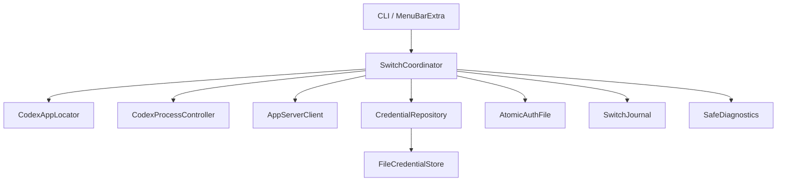

# 기술 설계

- 상태: Swift CLI·메뉴바 전환/복구, private JSON credential, 계정별 한도, 잠자기 방지 구현 완료
- 기준일: 2026-08-04
- 구현 순서: 검증된 Core 재사용 → SwiftUI 메뉴바 앱 → 엄격한 릴리스 인수

## 1. 설계 목표

공용 기본 `~/.codex`의 다른 상태는 그대로 두고 `auth.json`만 계정별로 전환한다. 전환은 파일 복사가 아니라 다음 불변조건을 가진 transaction이다.

- 단일 writer
- 공식 앱 정상 종료
- auth writer가 될 수 있는 프로세스 부재
- 현재·대상 이메일 검증
- 갱신된 토큰 보존
- 같은 파일시스템의 원자 교체
- 재실행 후 대상 검증
- 실패 시 검증된 이전 인증으로 롤백
- crash 후 journal 기반 복구

## 2. 현재 환경 기준선

### 개발 환경

| 항목 | 관찰값 |
|---|---|
| OS/architecture | macOS arm64 |
| Swift | Apple Swift 6.2.3 |
| 개발 도구 | Xcode Command Line Tools |
| 전체 Xcode | 현재 active developer directory에는 없음 |

Swift CLI와 `MenuBarExtra` 소스 앱은 현재 환경에서 SwiftPM과 Command Line Tools만으로 빌드된다. `Scripts/build-app.sh`는 release 실행파일을 `.app`으로 묶어 strict ad-hoc 서명한다. 전체 Xcode, Developer ID 서명과 공증은 공개 바이너리 배포 단계에서만 재검토한다.

| 소스 앱 배포 항목 | 값 |
|---|---|
| build 결과 | `.build/CodexAccountSwitcher.app` |
| 설치 경로 | `~/Applications/CodexAccountSwitcher.app` |
| bundle identifier | `local.codex.account-switcher` |
| LaunchAgent label | `local.codex.account-switcher` |

현재 제품 credential은 private JSON이므로 ad-hoc 재빌드의 Keychain ACL에 의존하지 않는다. 공개 바이너리 배포의 Developer ID 서명·공증은 별도 릴리스 게이트다.

### 공식 앱

| 항목 | 관찰값 |
|---|---|
| bundle path | `/Applications/ChatGPT.app` |
| bundle identifier | `com.openai.codex` |
| display/name | ChatGPT / Codex |
| main executable | `Contents/MacOS/ChatGPT` |
| version | `26.727.51351` |
| build | `6119` |
| bundled Codex | `Contents/Resources/codex` |
| signing Team ID | `2DC432GLL2` (현재 설치본 관찰값) |
| hardened runtime | 활성 |
| notarization ticket | stapled |

버전·hash·process 이름을 영구 하드코딩하지 않는다. bundle identifier로 앱을 찾고 매 실행 시 bundle metadata와 내부 실행 파일 계약을 검사한다.

### 인증

- 기본 활성 위치: `~/.codex/auth.json`
- 현재 파일 관찰 권한: `0600`
- 실제 토큰 값은 조사·문서·로그에 출력하지 않았다.
- 공식 문서상 `cli_auth_credentials_store = file | keyring | auto`가 존재한다.
- MVP는 실제 `auth.json`이 존재하는 file-backed 환경만 지원한다.

## 3. 제안 프로젝트 구조

```text
codex-account-switcher/
├── Package.swift
├── Sources/
│   ├── CodexAccountCore/
│   │   ├── Models/
│   │   ├── Credentials/
│   │   ├── AppServer/
│   │   ├── Processes/
│   │   ├── Transactions/
│   │   └── Diagnostics/
│   ├── CodexAccountSpike/
│   └── CodexAccountMenuBar/       # ADR-027 개발 승인 뒤 추가
├── Tests/
│   ├── CodexAccountCoreTests/
│   └── CodexAccountSpikeTests/
└── docs/
```

### 모듈 원칙

- `CodexAccountCore`: UI와 무관한 전환·복구 로직
- `CodexAccountSpike`: 로컬 검증용 CLI adapter
- `CodexAccountMenuBar`: 후속 `MenuBarExtra` UI
- Core는 프로세스, 저장소, App Server를 protocol로 주입받아 failure injection 테스트가 가능해야 한다.
- Mobius 전체를 포크하지 않는다. MIT 코드에서 유용한 UI/원자 저장 아이디어가 필요할 때만 출처를 유지하며 선택적으로 재구현 또는 재사용한다.

## 4. 핵심 컴포넌트



### `CodexAppLocator`

책임:

- `NSWorkspace.shared.urlForApplication(withBundleIdentifier:)`로 앱 위치 탐색
- 표준 fallback 경로 확인
- `Info.plist`의 identifier, executable, version, build 읽기
- `Contents/Resources/codex` 존재·실행 가능 확인
- 선택적으로 code signature identifier와 Team ID 확인
- 업데이트 시 capability probe 결과 반환

path만 같다고 공식 앱으로 신뢰하지 않는다. bundle id와 서명 정보를 함께 사용한다. Team ID가 현재 관찰값과 달라지면 auth를 변경하기 전에 차단하고 새 공식 배포인지 재검증한다.

### `CodexProcessController`

책임:

- 공식 앱 instance 탐색
- 사용자 승인 뒤 `NSRunningApplication.terminate()` 호출
- 종료 전 process tree 스냅샷
- 1초 유예 뒤 exact 앱 소유 잔존 PID를 별도 확인하고 승인 시에만 `SIGTERM` 1회
- 종료 제한 시간 동안 root·자식 PID 소멸 확인
- 독립 CLI/app-server 분류
- 앱 재실행과 창 활성화

금지:

- `forceTerminate()`
- `kill -9`
- 독립 CLI 자동 종료
- 전체 raw command line 로그

### `AppServerClient`

책임:

- 설치된 앱의 bundled Codex에서 `app-server` 실행
- stdio JSONL framing
- initialize handshake
- `account/read` 요청
- `account/rateLimits/read` 요청
- 이메일·plan·auth type의 제한된 결과 반환
- timeout과 자식 process 정리
- 격리 `CODEX_HOME`의 갱신된 `auth.json` 회수

### `CredentialRepository`

공통 interface:

- 프로필 목록·활성 프로필 읽기
- profile UUID로 credential blob 읽기·쓰기
- label/email uniqueness 검사
- 최대 등록 개수 정책 적용
- secret-free metadata 저장
- registry metadata는 destination과 같은 디렉터리의 `0600` temp에 전체 write하고 file `fsync`, POSIX `rename`, parent directory `fsync` 순서로 durable commit

구현은 CLI와 제품 모두 `FileCredentialStore`를 사용한다. 저장 위치는 제품 metadata 아래 `credentials/<profile-UUID>.json`, directory `0700`, file `0600`이다. JSON은 토큰 원문이며 같은 macOS 사용자 권한 프로세스에 대한 비밀 격리를 제공하지 않는다.

### `AtomicAuthFile`

책임:

- 파일 타입·owner·permission 검사
- JSON object와 필요한 인증 필드 유효성 검사
- SHA-256/크기/mtime 산출
- `0600` temp 생성, 전체 write, `fsync`, POSIX `rename`
- 교체 후 metadata 재검증
- symlink 거부

### `SwitchJournal`

책임:

- transaction phase를 secret-free JSON으로 지속
- crash 후 다음 행동 결정에 필요한 transaction/profile UUID, phase, 시각, 복원 불가능한 active auth SHA-256만 저장
- email, token, auth blob을 저장하지 않음
- journal destination과 같은 디렉터리에 `0600` temp를 만들고 전체 write, file `fsync`, POSIX `rename`, parent directory `fsync` 순서로 지속
- 각 phase를 durable하게 만든 뒤에만 다음 side effect를 시작
- registry commit을 durable하게 완료한 뒤 journal을 `unlink`하고 journal parent directory를 `fsync`
- journal 삭제 전 exact `schemaVersion, transactionId, journalPhase, expectedActiveProfileId, expectedActiveAuthSha256` finalization evidence를 같은 내구 쓰기 계약으로 저장하고 삭제 완료 뒤 제거
- auth digest는 finalization 시 새로 관찰한 값을 신뢰하지 않고, 이전 검증 또는 pre-mutation unchanged gate가 보존한 exact `FileIdentity`에서만 만든다.
- transaction lock 아래 phase/expected profile 합법성, registry, active auth digest, capture marker·verifier workspace 부재를 검증한다. `preparing`/`quitRequested` phase가 아니면 configured credential과 active auth도 exact 일치해야 한다.
- evidence와 journal이 함께 남은 crash window는 같은 공통 gate가 journal을 내구 삭제하고 상태를 다시 검증한 뒤 evidence를 제거한다. exact phase 일치와 finalization 실패 뒤의 `rollbackStarted` evidence/`rollbackFailed` journal 전이만 허용한다. journal이 화면상 없으면 parent directory `fsync` 뒤 같은 재검증을 수행한다.
- auth/credential/registry mutation 전 취소는 journal `unlink`와 parent directory `fsync`가 끝난 뒤 반환
- malformed/torn journal, 알 수 없는 phase, 필수 필드 누락을 자동 보정·삭제하지 않고 모든 auth write와 앱 실행을 중단

### `SafeDiagnostics`

구조화된 allow-list event만 기록한다. 임의 `Error.localizedDescription`, App Server stderr, process arguments를 그대로 기록하지 않는다.

## 5. 데이터 모델

### 프로필 metadata

```json
{
  "schemaVersion": 1,
  "activeProfileId": "UUID",
  "profiles": [
    {
      "id": "UUID",
      "label": "개인",
      "email": "display-only@example.invalid",
      "planType": "pro",
      "needsRelogin": false,
      "createdAt": "RFC3339",
      "updatedAt": "RFC3339"
    }
  ]
}
```

- 내부 구조는 배열이다.
- MVP 정책에서 등록은 최대 3개로 제한한다.
- profile ID는 UUID다. `personalAuth`/`workAuth` 같은 고정 필드를 만들지 않는다.
- 이메일은 MVP 식별자다. 등록 때 App Server가 반환한 문자열을 보존한다.
- 비교 시 임의 trim, case-fold, alias 정규화를 하지 않고 App Server 반환값의 완전 일치를 요구한다.
- `planType`은 표시값이며 identity가 아니다.

### credential blob

- opaque `Data`로 취급한다.
- 모델이 token 내부 필드를 공개 interface로 노출하지 않는다.
- 최소 구조 유효성만 검사하되 token 값을 반환·기록하지 않는다.
- 실제 이메일은 JWT를 직접 신뢰해 추출하지 않고 App Server 응답으로 확인한다.

### journal

주요 phase:

```text
preparing
quitRequested
quiescent
refreshingCurrent
currentSaved
validatingTarget
targetValidated
authReplaced
targetLaunched
verifyingTarget
targetVerified
rollbackStarted
rollbackFailed
```

성공 시 `targetVerified`에서 registry를 커밋한 뒤 journal을 삭제한다. `committed`와 `rolledBack`은 진단 event이며 persisted journal phase가 아니다.

필드:

```text
schemaVersion, transactionId, phase,
previousProfileId, targetProfileId,
startedAt, updatedAt
```

이 일곱 필드만 journal schema에 둔다. Codex version/build는 별도 진단 metadata이며 복구 판단용 journal에 넣지 않는다.

## 6. App Server 연결 설계

### 실행

```text
/Applications/ChatGPT.app/Contents/Resources/codex app-server --stdio
```

실제 경로는 locator 결과를 사용한다. `--listen stdio://`와 `--stdio`는 현재 설치본에서 지원된다.

### wire 계약

- transport: 일반 Pipe 기반 stdio
- framing: LF(`0x0A`)로 구분되는 JSON
- `Content-Length` header 없음
- wire 메시지에 `jsonrpc: "2.0"` 필드 없음
- chunk 하나가 메시지 하나라는 보장 없음
- notification이 response 사이에 끼어들 수 있음
- response는 `id`로 상관관계 처리
- 알 수 없는 top-level/notification field 허용

최소 순서:

1. `initialize` request 전송
2. 같은 ID의 response 대기
3. `initialized` notification 전송
4. `account/read` request 전송
5. 같은 ID의 response 대기
6. stdin EOF
7. 정상 process 종료와 stdout/stderr drain

initialize 전에 account 요청을 보내지 않는다. 필요한 response 전에 stdin을 닫으면 연결 해제 race가 발생하므로 금지한다.

### process I/O

- stdin, stdout, stderr를 별도 `Pipe`로 둔다.
- stdout은 누적 buffer에서 LF 단위로 분리한다.
- stderr는 protocol이 아니며 별도 동시 drain한다.
- stderr 원문은 진단 로그에 남기지 않고 stable 분류 코드만 만든다.
- 제한 시간 초과 시 Helper가 생성한 자식 app-server에만 정상 terminate를 요청한다.
- 종료되지 않으면 다음 auth write를 차단한다.

### 격리 홈

대상 계정의 사전 identity 검증·refresh는 임시 `CODEX_HOME`에서 수행한다.

1. `0700` 임시 디렉터리 생성
2. 검증 대상 blob을 `auth.json` `0600`으로 materialize
3. file credential mode를 명시
4. App Server handshake
5. `account/read(refreshToken: false)`로 저장된 대상 이메일과 완전 일치 확인
6. 일치할 때만 `account/read(refreshToken: true)`로 refresh
7. refresh 응답 이메일이 5번의 이메일과 여전히 완전 일치하는지 확인
8. refresh된 `auth.json` 회수
9. app-server 종료 확인
10. refreshed blob을 대상 secure store에 durable하게 저장
11. 임시 디렉터리 삭제

App Server는 빈 홈에도 `installation_id`, SQLite, log, plugin lock 등을 만들 수 있으므로 대상 사전 검증과 재실행 후 판독용 홈은 격리한다.

예외는 **떠나는 현재 계정의 최신화**다. 공식 앱과 독립 Codex 프로세스가 모두 종료된 뒤 먼저 `refreshingCurrent`를 durable하게 기록한다. 그다음 Helper가 소유한 App Server를 기본 `~/.codex`에서 file credential mode로 실행하고 `account/read(refreshToken: true)`를 호출한다. 이렇게 하면 refresh 결과가 active `auth.json` 자체에 반영된다. Helper는 해당 PID 종료와 이전 프로필 이메일 일치를 확인한 후 refreshed blob을 현재 secure store에 durable하게 저장하고 `currentSaved`를 기록한다. 대상 사전 검증과 재실행 후 이메일 판독은 계속 격리 홈을 사용한다.

### 앱 재실행 후 검증의 의미

공식 데스크톱 앱의 private Electron IPC에 연결하지 않는다. 재실행 뒤에는 현재 공용 `auth.json`의 사본만 임시 격리 홈에 materialize하고 Helper 소유 App Server에서 `account/read(refreshToken: false)`를 호출한다. 이 verifier PID는 Helper가 직접 추적하고 종료한다. post-launch verifier는 active auth 사본 이외의 데스크톱 내부 상태나 private IPC를 읽지 않는다.

이 방식이 직접 증명하는 것은 **재실행 뒤 공용 active auth 파일의 이메일**이다. 데스크톱 프로세스 메모리가 같은 계정을 사용한다는 사실까지 단독으로 증명하지는 않는다. 그 연결은 현재 Codex build에서 동일 task의 실제 메시지 왕복 3회 Spike로 검증한다. 새 build에서는 호환성 gate와 guarded rollback을 다시 적용한다. 매 전환마다 모델 prompt를 보내 계정을 확인하지 않는다는 사용자 결정을 유지한다.

Helper verifier는 공용 `CODEX_HOME`을 직접 사용하지 않으므로 데스크톱 app-server와 동일 홈의 writer 경쟁을 만들지 않는다. 앱이 active auth를 다시 덮어썼다면 재실행 후 복사한 bytes와 이메일/hash 관찰에서 드러나야 한다.

## 7. 프로세스 탐색·분류

### 관찰된 현재 계층

```text
ChatGPT main (bundle root)
├── Service / Renderer helpers
├── bundled codex app-server
│   ├── node_repl
│   └── code-mode-host
└── 기타 Electron helpers

browser_crashpad_handler (일부는 PPID 1로 재부모화)
ChatGPT for Chrome (별도 앱, 대상 아님)
```

### 정보 수집

- `NSRunningApplication`: bundle id 기반 root PID
- libproc `proc_listallpids`: 전체 PID snapshot
- libproc `PROC_PIDTBSDINFO`: PID/PPID/이름
- libproc `proc_pidpath`: executable path
- 가능하면 `PROC_PIDVNODEPATHINFO`: cwd

process argument나 environment는 읽거나 기록하지 않는다.

### 분류 규칙

분류 순서는 안전 판정의 일부다.

1. `approvedNonAuthResident`: 별도 실증으로 auth 비관여가 입증됐고 exact signed bundle path tuple 또는 아래 pathless Crashpad 조건을 만족하는 process. blocker 집합을 만들기 전에 먼저 분류한다.
2. `appRoot`: `com.openai.codex`의 `NSRunningApplication` PID
3. `appOwned`: root의 descendant 또는 공식 bundle 내부 executable path
4. `bundledAppServer`: bundle 내부 `Resources/codex`이며 app root ancestry가 있음
5. `helperOwnedProbe`: 현재 Helper가 직접 spawn하고 PID/start time을 추적하는 bundled codex
6. `independentCodex`: basename `codex`이면서 앱 ancestry/helper-owned가 아님
7. `unclassifiedRelevant`: Codex bundle path 또는 알려진 관련 이름이지만 안전 분류 불가

blocker 집합은 `approvedNonAuthResident`를 제외한 `appRoot`, `appOwned`, `bundledAppServer`, `independentCodex`, `unclassifiedRelevant`다. 앱 검사 시 `Versions/Current`를 canonicalize한 bundle 내부 regular executable의 정적 서명을 검증해 경로를 고정한다. 실행 중인 Crashpad는 그 exact path tuple이 일치하거나, updater가 executable을 제거해 `proc_pidpath`가 비어 있는 PPID 1 process가 커널 기준 `VALID`, `SIGNED`, hardened runtime, Developer ID, signing identifier, Team ID 검증을 모두 통과할 때만 `approvedNonAuthResident`다. version/build 번호는 판정에 쓰지 않는다.

### 종료 알고리즘

1. root PID와 descendants를 종료 전에 snapshot한다.
2. 각 `NSRunningApplication`에 `terminate()`를 보낸다.
3. 1초 동안 root와 이전 descendant PID 종료를 poll한다.
4. 남은 blocker가 모두 종료 전 snapshot의 exact 앱 소유 PID·start time·executable path와 같을 때 별도 사용자 확인을 받는다.
5. 승인 시에만 `SIGTERM`을 한 번 보낸다. 거부·EOF면 auth mutation 없이 차단한다.
6. 신호 직전 identity와 path를 다시 확인해 PID 재사용을 차단한다.
7. bundle path에 남은 reparent process까지 종료됐는지 확인한다.
8. 독립·분류 불명·새 process가 있거나 제한 시간 뒤 앱 소유 process가 남으면 auth mutation 없이 차단한다.

### crashpad 예외

현재 설치본에서는 `browser_crashpad_handler`가 PPID 1로 재부모화될 수 있다. 이 프로세스가 auth writer라는 근거는 없지만, 이름만으로 무조건 허용하지 않는다.

Spike에서 다음을 확인했다.

- 앱 종료 후 지속 여부
- auth 파일 open/write 여부
- 앱 재실행과 무관한 crash reporter인지

기본 규칙은 현재 공식 bundle에서 canonicalize하고 정적 서명을 검증한 Crashpad의 exact path·executable name·signing identifier·Team ID 조합이다. Codex 업데이트 뒤 이전 Crashpad executable이 삭제되면 실행 PID는 남아도 `proc_pidpath`와 Security.framework guest 검증이 `ENOENT`를 반환할 수 있다. 이때만 커널 `csops`의 동적 상태가 `CS_VALID | CS_SIGNED | CS_RUNTIME`, 비 ad-hoc·비 debugged, Developer ID 범주이고 identity=`browser_crashpad_handler`, Team ID=`2DC432GLL2`, PPID=1인 process를 pathless resident로 허용한다. 하나라도 다르거나 현재 설치 descriptor의 기존 정적 검증이 실패하면 차단한다.

## 8. 전환 transaction

### 정상 경로

모든 행에서 현재 phase의 journal write가 file `fsync`, `rename`, parent directory `fsync`까지 끝난 뒤에만 다음 side effect를 시작한다.

| durable phase | 다음 동작 | 완료 조건과 다음 durable phase |
|---|---|---|
| `preparing` | lock 획득 상태에서 호환성, registry, 현재/대상 profile 참조 검사 | 정상 종료 요청 직전 `quitRequested` |
| `quitRequested` | `NSRunningApplication.terminate()` 요청, 1초 뒤 exact 앱 소유 잔존은 별도 승인 후 `SIGTERM` 1회 | root/descendant/독립 CLI blocker가 모두 없으면 `quiescent` |
| `quiescent` | 현재 active source와 previous profile의 사전 일치 확인 | 기본 홈 helper를 시작하기 직전 `refreshingCurrent` |
| `refreshingCurrent` | 기본 `~/.codex`에서 Helper-owned App Server `account/read(refreshToken: true)` 실행 | Helper PID 종료, previous 이메일 일치, refreshed source blob의 current credential store durable 저장 후 `currentSaved` |
| `currentSaved` | source 최신본이 active auth와 secure store 양쪽에 존재함을 확인 | 대상 격리 probe 시작 직전 `validatingTarget` |
| `validatingTarget` | 대상 격리 홈에서 `false` identity 확인, `true` refresh, 같은 이메일 재확인 | refreshed target blob의 대상 secure store durable 저장 후 `targetValidated` |
| `targetValidated` | refreshed target blob을 공용 `auth.json`에 원자 교체 | 교체 metadata 확인 후 `authReplaced` |
| `authReplaced` | 공식 앱 실행 | launch 요청 성공 후 `targetLaunched` |
| `targetLaunched` | post-launch 검증 준비 | active auth 사본을 만들기 직전 `verifyingTarget` |
| `verifyingTarget` | active auth 사본을 격리 홈에서 `account/read(refreshToken: false)`로 검증 | 대상 이메일 완전 일치 후 `targetVerified` |
| `targetVerified` | `registry.activeProfileId`를 target으로 durable commit | registry parent `fsync` 완료 후 journal `unlink`, journal parent `fsync`, lock 해제 |

표의 credential store는 CLI와 제품이 공유하는 repo 밖 `0700` directory의 `0600` private JSON store다. 같은 phase 순서와 durable-save 완료 조건을 적용한다.

대상 사전 검증은 active `auth.json`을 변경하지 않는다. `false` identity 확인, `true` refresh, 동일 이메일 재확인, refreshed blob의 durable credential-store 저장이 모두 성공해야 `targetValidated`가 된다. 중간 실패 시 active source는 그대로 두고 대상 profile과 기존 credential을 보존한다. 명시적인 인증 만료·폐기·refresh 거부·identity 불일치는 `needsRelogin`으로 분류한다. network/timeout/DNS 실패나 credential-store write 실패는 token 폐기 또는 계정 revocation으로 단정하지 않으며 `needsRelogin`을 바꾸지 않는다.

현재 token refresh 뒤 오류가 발생하면 `rollbackStarted`를 먼저 durable하게 기록하고 secure store의 검증된 previous blob을 공용 auth에 원자 복구한다. previous 이메일 검증→registry previous durable commit→journal unlink와 parent `fsync`를 순서대로 완료한 뒤에만 previous 앱을 다시 연다. 실패하면 `rollbackFailed`를 durable하게 기록하고 앱을 열지 않는다.

명시적 `rollbackFailed` 복구 결과는 세 가지다. journal 내구 삭제와 앱 PID 확인이 모두 끝나면 `restoredAndLaunched`, journal 내구 삭제 뒤 앱 PID만 확인하지 못하면 `restoredButLaunchUnconfirmed`, journal unlink 결과 또는 parent `fsync`가 불확실하면 `journalFinalizationUncertain`이다. 마지막 분기에서는 앱을 실행하지 않는다. 이후 상태 조회와 모든 mutation gate는 lock 아래 phase/expected profile, registry, 이전에 검증된 active auth SHA-256, configured credential, 잔존 artifact를 재검증한다. journal이 남으면 내구 삭제하고 상태를 다시 검증한 뒤 evidence를 제거한다. journal이 없으면 store directory `fsync` 뒤 같은 순서로 정리한다. 실패하면 `blocked`, 모두 성공하면 그때만 `none`이다.

아직 auth, credential, registry mutation이 전혀 없는 상태에서 사용자가 취소하면 journal을 `unlink`하고 parent directory를 `fsync`한 뒤에만 취소 완료를 반환한다. mutation 가능성이 있거나 durable 여부가 모호하면 journal을 삭제하지 않고 recovery로 진입한다.

### 이미 활성인 프로필

- credential read/write 없음
- journal 없음
- 앱이 실행 중이면 창 활성화
- 앱이 닫혔다면 현재 이메일을 검증한 뒤 앱 실행

### 사전 실패

`authReplaced` 이전 실패는 대상 전환 롤백이 아니라 현재 계정 정상화다.

- current refresh와 대상 secure store update가 시작되지 않았다면 active auth를 건드리지 않고 journal을 durable delete
- 현재 token을 refresh했다면 `rollbackStarted`를 기록하고 secure store의 검증된 current blob을 공용 auth에 반영 후 이메일 검증
- 대상 validation/refresh 실패 시 active auth는 그대로 유지하고 대상 profile/기존 blob을 보존
- 명시적인 target credential 거부나 identity 불일치만 `재로그인 필요`로 표시하며 network 실패는 revocation으로 분류하지 않음
- 검증 성공 후에만 앱 실행

### 사후 실패

`authReplaced` 이후 오류는 `06_security_and_recovery.md`의 자동 롤백을 실행한다.

## 9. 계정 등록 설계

### 첫 프로필

- 명시 확인 뒤 capture marker·credential·journal 생성 전에 공용 정상 종료·quiescence 경계 적용
- 독립·새·분류 불명 프로세스는 signal 없이 차단
- 현재 활성 auth를 격리 probe로 검증·refresh
- 이메일 존재와 ChatGPT type 확인
- private JSON credential 저장
- registry 생성, active 지정, 공식 앱 재실행

### 추가 프로필

- 등록 시작 전 recovery 부재, 활성 프로필 저장본, 공용 auth exact identity, 앱·번들 CLI 서명 확인
- 격리 `CODEX_HOME`의 공식 `codex login` 실행과 helper 소유 child만 exact PID로 취소
- 격리 App Server false→true→false probe의 동일 이메일과 기존 이메일 비중복 확인
- 새 credential보다 같은 UUID의 inactive·`needsRelogin` registry intent를 먼저 durable 저장
- credential round-trip 뒤 marker를 해제하고 registry round-trip 확인
- 기존 active profile ID·공용 auth·기존 저장본을 전후 비교하고 공식 앱 종료·재실행 없음
- 취소·실패는 새 credential/metadata를 함께 rollback하며, 중단된 intent는 재로그인·삭제 가능

등록 한도 초과는 `ProfileRegistry`와 capture gate에서 모두 거부한다.

## 10. crash recovery 설계

메뉴바의 첫 상태 조회와 mutation 실패 뒤 refresh는 profile·recovery 조회 전에 recovery coordinator를 한 번 실행한다. CLI `recovery status`는 일반 auth/registry 복구를 실행하지 않고, 기존 finalization evidence 정리만 멱등 재개할 수 있다.

1. lock 획득
2. journal bytes와 schema를 읽고 필드 집합·phase·UUID·시각을 검증
3. malformed/torn JSON, 알 수 없는 phase, 필수 필드 누락, 모순된 ID면 즉시 STOP. 자동 보정·삭제·auth write·앱 실행 금지
4. 공식 앱과 관련 프로세스 상태 확인
5. 파일 mutation이 필요한 phase에서 관련 process가 실행 중이면 journal을 유지하고 STOP. 시작 자동 복구는 종료 승인 UI를 띄우거나 프로세스를 종료하지 않음
6. 현재 active auth의 사본을 격리 홈에서 `refreshToken: false`로 읽고 previous/target secure blob 검증 결과와 조합
7. 아래 phase table의 한 경로만 실행
8. 모든 phase/registry write와 journal delete에 정상 transaction과 같은 file/parent `fsync` 규칙 적용

registry alone 또는 journal alone으로 commit을 추론하지 않는다. phase, active auth identity, previous/target secure blob을 함께 확인한다.

| persisted phase | recovery 동작 |
|---|---|
| `preparing` | active가 previous이고 registry도 previous면 mutation 전 abort로 처리해 journal을 durable delete한다. 불일치하면 STOP한다. |
| `quitRequested` | process gate와 active previous를 확인하고 journal을 durable delete해 안전 취소한다. journal schema에 원래 실행 상태를 저장하지 않으므로 앱은 자동 재실행하지 않는다. 종료 여부·identity가 모호하면 STOP한다. |
| `quiescent` | active가 exact previous면 journal을 durable delete해 안전 취소한다. previous 이메일이지만 configured blob과 다르면 `rollbackStarted` 뒤 기본 홈에서 `true` refresh·저장을 완료하고, 실패하면 stored previous를 복구한다. exact target이면 `rollbackStarted` 뒤 stored previous를 복구하며 다른 신원·판독 불가는 STOP한다. |
| `refreshingCurrent` | source-valid이면 기본 홈 Helper-owned App Server의 `true` refresh와 current credential-store save를 idempotent하게 완료한다. source-valid가 아니면 stored previous를 복구한다. 어느 분기든 previous 이메일과 registry previous를 확인하고 journal을 durable delete해 전환을 안전 취소한다. |
| `currentSaved` | active가 exact previous면 current credential store도 previous인지 확인하고 안전 취소한다. exact target이면 previous rollback을 시작하며 다른 신원·판독 불가는 STOP한다. |
| `validatingTarget` | 남은 isolated home/probe를 Helper-owned 여부로 정리한다. exact previous인 일반 switch는 안전 취소하고, exact target인 재로그인은 configured source를 복원·검증한다. 다른 신원·판독 불가는 STOP한다. registry previous를 유지하며 검증 저장된 target blob·해제된 marker는 보존할 수 있지만 forward switch는 재개하지 않는다. |
| `targetValidated` | rename crash window를 고려해 active를 판독한다. 일반 switch는 previous면 journal을 durable delete해 안전 취소하고 target이면 `rollbackStarted`를 기록해 previous rollback한다. 추가 등록은 registry target·exact target auth·target capture marker가 함께 일치할 때만 `targetVerified`로 전진해 정리한다. 다른 신원·판독 불가는 STOP한다. |
| `authReplaced` | target launch를 재개하지 않는다. 관련 process가 실행 중이면 종료하지 않고 STOP하며, process gate가 깨끗할 때만 previous rollback한다. |
| `targetLaunched` | 관련 process가 실행 중이면 종료하지 않고 STOP한다. 사용자가 모두 종료한 뒤 다음 자동 복구에서 previous rollback한다. |
| `verifyingTarget` | 관련 process가 실행 중이면 종료하지 않고 STOP한다. gate가 깨끗하면 previous rollback하며 network 실패는 target revocation이나 `needsRelogin` 근거로 사용하지 않는다. |
| `targetVerified` | active target·configured target·marker를 다시 확인하고 registry target commit을 durable하게 완료한다. 이미 commit됐으면 중복 write 없이 journal 정리만 수행한다. typed `target-unverified`만 previous rollback하며 process·registry race, verifier 종료 미확인, 내구성 불확실은 STOP한다. |
| `rollbackStarted` | active가 previous 이메일이지만 configured blob과 다르면 중단된 source repair로 보고 기본 홈의 `true` refresh·저장을 재개하며, 실패하면 stored previous를 복구한다. 그 외 verified previous/target은 관련 writer가 없는지 확인한 뒤 stored previous blob을 공용 auth에 원자 복구하고 격리 `false` probe로 previous 이메일을 검증한다. 성공하면 registry previous durable commit→journal unlink와 parent `fsync`로 끝낸다. 시작 자동 복구는 previous 앱을 실행하지 않는다. |
| `rollbackFailed` | terminal로 반환하며 locator·process scan·workspace 정리·auth/registry write·앱 실행을 하지 않는다. configured credential store의 previous/target 원본을 보존하고 명시적 수동 recovery만 허용한다. |

previous rollback 중 어떤 단계든 실패하면 `rollbackFailed`를 durable하게 기록한다. 성공 phase를 추측해 journal을 지우지 않는다.

## 11. CLI 인터페이스

`inspect`, `profiles list`, 최대 3개의 `profile capture`, 추가 등록 격리 로그인·비활성 저장, `profile sync-active`, 일반 `switch`, `recovery status`, `recovery restore`는 구현됐다. `verify`, `cleanup`은 예정 인터페이스다.

```text
codex-account-spike inspect
codex-account-spike profiles list
codex-account-spike profile capture --label 개인
codex-account-spike profile capture --label 회사
codex-account-spike switch --target <profile-id-or-label>
codex-account-spike verify --expected <profile-id-or-label>
codex-account-spike recovery status
codex-account-spike recovery restore --profile <profile-id-or-label>
codex-account-spike cleanup
```

원칙:

- destructive/auth-changing 명령은 interactive 확인을 요구한다.
- 자동화용 `--yes`는 Spike에서 기본 제공하지 않는다.
- token, auth path snapshot 내용, raw App Server 출력 옵션을 제공하지 않는다.
- `inspect`는 비파괴이며 마스킹 정보만 출력한다.

## 12. 메뉴바 앱 Phase 2

ADR-027의 개발 승인에 따라 다음 최소 기능만 추가한다.

- `MenuBarExtra`
- 최대 3개 프로필 카드
- 활성 이메일/레이블 표시
- 비활성 카드 클릭 전환
- 실행 중이면 항상 종료 확인
- 정상 종료 뒤 exact 앱 소유 잔존은 native 비동기 2차 확인 뒤에만 `SIGTERM` 1회
- 현재 로그인 등록은 별도 확인 뒤 같은 정상 종료 경계를 거쳐 성공 시 앱 재실행
- 단계별 상태와 안전한 오류 표시
- 이미 활성 카드 클릭 시 Codex 창 활성화
- 재로그인 필요 표시
- 재로그인 필요 비활성 카드의 exact-ID 격리 로그인과 기존 active 유지
- `rollbackFailed` journal의 exact transaction ID와 previous profile을 확인 snapshot에 묶고, Core lock 안에서 둘 다 재검증한 뒤에만 수동 복구
- 복구 성공·앱 launch 미확인·journal finalization 불확실을 typed outcome으로 구분하고 마지막 두 분기에서 auth 복구 재시도 금지

전환 진행 표시는 `SwitchCoordinator`가 각 journal create/update의 내구 성공 직후 내보내는 `SwitchPhase` callback만 사용한다. UI는 이를 현재 단계 문구로 매핑하며 퍼센트·예상 시간·실행 중 취소를 추정하지 않는다. 이미 활성인 프로필의 무변경 경로는 journal phase를 만들지 않으므로 진행 callback도 내보내지 않는다.

재로그인은 추가 등록과 같은 격리 로그인 helper를 사용한다. exact inactive profile ID와 active source를 확인하고, 별도 `CODEX_HOME`의 브라우저 로그인에서 대상 이메일을 false→true→false로 검증한 뒤 대상 JSON credential과 marker만 교체한다. 공용 auth, active ID, source credential, 공식 앱 process는 전후 exact 상태를 유지한다.

메뉴바는 재로그인 확인을 일반 전환 pending과 분리하고 `presenting` snapshot의 opaque ID를 Core에 한 번만 전달한다. 호출 직전과 반환·throw 뒤 profile/recovery를 다시 읽는다. `recovery=none`, 기존 source 단일 active, 대상 `needsRelogin=false`일 때만 성공이다. wrong-ID outcome, pending·blocked, 반환 뒤 상태 불일치는 STOP이다.

잔존 프로세스 2차 확인은 기존 Core confirmation 경계를 async로 연결한다. 취소가 기본 동작이며, 승인해도 정상 종료 요청 전에 캡처한 PID·시작 시각·실행 경로가 signal 직전까지 모두 같은 앱 소유 대상에만 `SIGTERM`을 한 번 보낸다. 새 process, identity가 바뀐 process, 독립 CLI, 분류 불명 process는 확인 후보로 넓히지 않고 STOP한다.

### 계정 한도 조회

`LocalCLIDataProvider.profileUsage`는 transaction lock과 recovery gate 아래 저장 프로필을 순차 조회한다. 각 프로필은 private 검증 workspace의 임시 인증으로 `account/read` identity 확인 뒤 `account/rateLimits/read`를 호출한다. 공용 `auth.json`, registry, 저장 credential은 변경하지 않는다.

- 앱 시작·수동 새로고침: 모든 프로필
- 자동 조회 tick: 2분
- 마지막 전체 조회 후 30분 미만: 활성 프로필만
- 마지막 전체 조회 후 30분 이상: 모든 프로필
- 계정 mutation 시작: 진행 중 자동 조회 취소 후 기존 Core lock 적용
- 표시: `rateLimitsByLimitId["codex"]`, 서버 기간 `Nm`·`Nh`·`Nd`, 각 카드 plan·남은 비율·초기화 시각
- 메뉴바: 활성 프로필 창 중 최소 잔여율, 링·숫자, 자동 조회 중 맥동

자동 조회 실패는 마지막 정상 수치를 유지한다. 수동/초기 전체 조회 실패는 해당 프로필 실패 상태로 표시하며 어떤 조회 실패도 계정 전환 결과나 인증 상태를 바꾸지 않는다.

### 잠자기 방지

`SleepPreventionSystem`은 `/usr/bin/pmset -g` 출력을 읽고 `SleepDisabled 0|1`만 허용한다. 변경은 `NSAppleScript`의 관리자 인증으로 고정 명령 `/usr/bin/pmset -a disablesleep 0|1`을 실행하며, 반환 뒤 다시 읽은 실제 값이 요청과 같아야 성공한다.

초기 읽기 실패는 `SleepPreventionViewModel`이 켜짐 fail-safe와 오류를 표시한다. 변경·사후 검증 실패 뒤에는 실제 상태를 다시 조회하고, 끝내 알 수 없으면 켜짐으로 표시한다. 켜짐은 메뉴바 커피 배지로 표시한다. 설정은 앱 수명과 무관한 시스템 전체 상태이므로 UI에 발열·배터리·지속성 경고를 둔다.

후속 범위:

- 4개 이상 계정 UI
- Developer ID 서명·공증·업데이트

## 13. 오류 분류

stable code 예시:

```text
APP_NOT_FOUND
APP_ID_MISMATCH
APP_SIGNATURE_MISMATCH
APP_QUIT_CANCELLED
APP_QUIT_TIMEOUT
RELATED_PROCESS_REMAINS
INDEPENDENT_CODEX_RUNNING
AUTH_FILE_INVALID
AUTH_FILE_UNSAFE_PERMISSIONS
CURRENT_IDENTITY_MISMATCH
TARGET_NEEDS_RELOGIN
TARGET_IDENTITY_MISMATCH
APP_SERVER_TIMEOUT
ATOMIC_REPLACE_FAILED
TARGET_LAUNCH_FAILED
TARGET_VERIFY_FAILED
ROLLBACK_FAILED
RECOVERY_REQUIRED
```

오류에는 token, auth JSON, raw stderr, raw command line을 붙이지 않는다.

## 14. 테스트 seam

Core protocol로 다음 실패를 결정적으로 주입할 수 있어야 한다.

- 앱 종료 거부/timeout
- 잔존 process
- 메뉴바 잔존 process 2차 확인의 비동기 대기·거부와 새 process 무신호 차단
- 독립 CLI 발견
- 대상 refresh 실패
- 대상 `false` identity 성공 뒤 `true` refresh의 이메일 변경
- 대상 network 실패가 `needsRelogin`을 바꾸지 않음
- 재로그인 false→true→false 사이 identity 변경과 공용 auth/source credential race
- B credential 저장 뒤 marker 해제 실패의 기존 저장본·registry rollback
- 로그인 시작 직전과 각 probe 뒤 취소
- 메뉴바 재로그인 확인 취소·stale snapshot·wrong-ID outcome·mutation 뒤 throw
- refreshed target configured-store 저장 후 `targetValidated` 기록 전 crash
- 현재 refresh 후 crash
- `refreshingCurrent` recovery에서 source refresh 완료 또는 stored source 복구 후 안전 취소 분기
- temp write/fsync/rename 실패
- parent directory fsync 실패
- registry durable commit 전 journal delete 시도 거부
- registry durable commit 후 journal unlink 전 crash의 idempotent 완료
- malformed/torn/unknown-phase journal에서 STOP
- 대상 launch 실패
- 대상 이메일 불일치
- rollback replace 실패
- 이전 이메일 검증 실패
- journal write/delete 실패
- lock 경쟁
- crashpad exact-path·pathless kernel-signature 선분류와 기본 blocker 동작

실제 프로세스·App Server test는 임시 `CODEX_HOME`과 가짜 auth fixture만 사용한다. 실제 두 계정 테스트는 별도 black-box Runbook에서만 수행한다.

## 15. 호환성 정책

### 매 실행 hard gate

- bundle id
- code signature identity
- bundled Codex 존재·실행 가능
- App Server initialize 성공
- `account/read` method 존재·응답 decode 가능
- file-based active auth 존재·안전 권한

### build 변경 시

- 경고 표시
- generated JSON Schema를 임시 디렉터리에 생성해 필요한 method 확인 가능
- hard gate 통과 시 guarded switch 허용
- 실제 검증 실패 시 자동 롤백
- 최초 새 build 성공은 진단 metadata에 기록

## 16. 구현 금지 항목

- 공식 앱 bundle 수정·복제
- Electron user-data 직접 수정
- token 구조에 의존한 사용자 identity 판정
- 사용량으로 계정 identity 추정
- exact 앱 소유 잔존 외 force quit
- `SIGKILL`
- 독립 CLI 자동 kill
- repo 내부 실제 auth 저장
- credential store 실패 시 다른 저장소 fallback
- 동일 task 실패 시 새 task 자동 복제
- 명시적 개발 승인 전 메뉴바 UI 구현

## 17. 실증 결과와 남은 릴리스 게이트

실계정에서 앱 종료 후 auth 채택, background writer 비간섭, token refresh, crashpad allow-list와 B-011 자동 롤백을 확인했다. 동일 task의 A↔B 메시지 왕복 3회는 사용자 확인으로 완료됐다.

cycle nonce와 단계별 task ID 기록은 보존하지 않아 B-010 정식 PASS로 표시하지 않는다. ADR-027은 이 공백을 개발 착수에만 수용한다. 메뉴바 MVP 완료·배포 전 같은 task ID와 nonce를 포함한 정식 인수 증거를 확보한다. 구조적 ownership 실패가 확인되면 즉시 제품 NO-GO다.
