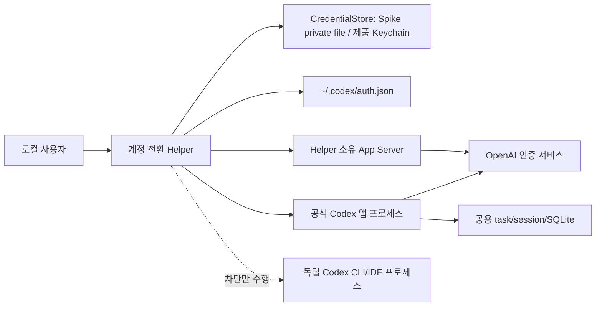

# 보안·복구 설계

- 상태: Swift CLI Spike·manual recovery typed outcome·durable finalization gate·Keychain backend·메뉴바 provider/등록/활성 인증 sync/수동 복구 완료, 메뉴바 재로그인·실 Keychain·배포 보안 검증 전
- 기준일: 2026-07-31
- 적용 대상: Swift CLI Spike와 후속 macOS 메뉴바 앱

## 1. 보안 목표와 비목표

### 목표

1. 저장된 모든 프로필의 인증 토큰이 로그, repo, crash report, UI 오류에 노출되지 않는다.
2. 인증 교체는 관련 프로세스가 종료된 상태에서만 수행된다.
3. 부분 실패나 crash가 발생해도 어느 프로필이 활성인지 추론·복구할 수 있다.
4. 대상 계정 검증 실패 시 이전 인증을 자동 복구한다.
5. 복구 상태를 검증할 수 없으면 공식 앱을 실행하지 않는다.
6. 외부 로그인 변경이나 동시 실행이 알려진 프로필을 자동 오염시키지 않는다.

### 비목표

- 개인·회사 데이터 격리
- 회사 정보유출방지 정책 우회
- 서로 다른 macOS 사용자 간 비밀 공유
- 공격자가 이미 사용자의 로그인 세션과 Keychain을 장악한 상황 방어
- 공식 Codex 앱 내부 인증 구현의 보안 보증
- App Store sandbox 배포

이 helper는 동일 macOS 사용자 권한으로 실행되는 편의 도구다. `CODEX_HOME`의 대화·task·history·SQLite·설정은 의도적으로 공유된다.

## 2. 보호 자산

| 자산 | 민감도 | 저장 위치 | 보호 원칙 |
|---|---|---|---|
| access/refresh/id token | 최상 | Spike 전용 `0600` 파일, 제품 Keychain | 원문 출력·전송 금지 |
| 활성 `auth.json` | 최상 | `~/.codex/auth.json` | 일반 파일·소유자·권한·원자성 검증 |
| 계정 이메일 | 중간 | secret-free registry/UI | 로그에서는 마스킹 |
| 프로필 ID | 낮음 | registry/journal | 이메일 대신 transaction 식별에 사용 |
| task/session/history | 높음 | 공용 `~/.codex` | 계정 간 공유 사실을 명시 |
| switch journal/finalization evidence | 낮음 | Application Support | 고정 schema 외 값·토큰·이메일·build 미포함 |
| 진단 로그 | 중간 | Application Support/logs | 최소 수집·짧은 보존 |

## 3. 신뢰 경계



- Helper는 공식 앱을 수정하거나 주입하지 않는다.
- Helper 소유 app-server는 설치된 공식 앱의 bundled `codex`를 사용한다.
- 독립 CLI는 Helper가 종료할 권한을 갖지 않는다. 발견 시 사용자에게 종료를 맡긴다.
- 신원 판정은 App Server의 공식 `account/read` 응답을 사용한다. `refreshToken: false` 응답은 이메일 판정 근거이며, 그 자체로 token의 온라인 유효성이나 폐기 여부까지 증명하지 않는다.

## 4. 위협과 통제

### 4.1 토큰 원문 유출

위협:

- 인증 JSON 전체 출력
- Swift 오류의 `Data`/JSON description 출력
- shell tracing 또는 raw command line 기록
- repo·테스트 fixture·리포트에 실제 인증 저장
- 임시 파일의 느슨한 권한

통제:

- 인증 blob을 문자열 보간 가능한 타입으로 만들지 않는다.
- `CustomStringConvertible` 구현 시 오직 `<redacted auth blob>`만 반환한다.
- 로그 allow-list: 시각, 앱 build, phase, profile UUID, 마스킹 이메일, 파일 SHA-256, 크기, 수정 시각, PID, 안전한 오류 코드.
- stderr/stdout 원문을 사용자 로그로 그대로 전달하지 않는다.
- repo 아래에 실제 auth fixture를 생성하지 않는다.
- 디렉터리 `0700`, 파일 `0600`, 생성 시 `umask`에 의존하지 않고 명시한다.
- 임시 파일은 대상과 같은 디렉터리에서 예측 불가능한 이름과 `O_EXCL | O_NOFOLLOW`로 생성한다.

### 4.2 symlink·파일 대체 공격

위협:

- `auth.json` 또는 임시 파일이 symlink라서 다른 파일을 덮어씀
- 검증과 쓰기 사이에 대상이 바뀜
- group/other 사용자가 쓰기 가능한 경로

통제:

- `lstat`으로 symlink를 거부하고 일반 파일만 허용한다.
- 활성 auth의 상위 디렉터리와 소유자를 검사한다.
- 파일 descriptor 기반 생성·쓰기·`fsync` 후 같은 파일시스템에서 `rename`한다.
- 교체 직전 다시 process gate와 파일 identity를 확인한다.
- 예상하지 못한 inode/mtime 변경은 동시 writer로 간주하고 중단한다.

### 4.3 실행 중 프로세스의 stale token 재기록

위협:

- Electron main/helper가 종료 후에도 남아 이전 토큰을 기록
- 공식 앱의 bundled app-server가 reparent돼 생존
- 독립 CLI/IDE가 공용 `CODEX_HOME`의 토큰을 갱신

통제:

- bundle identifier로 공식 root PID를 얻고 종료 전 자식 PID 집합을 스냅샷한다.
- 정상 종료 요청 후 1초 유예한다.
- 남은 프로세스가 종료 전 snapshot의 exact 앱 소유 PID·시작 시각·실행 경로와 같을 때 별도 승인을 받고, 승인 시에만 `SIGTERM`을 한 번 보낸다.
- 앱 트리에 속하지 않은 `codex`, `codex app-server` 후보를 독립 프로세스로 분류한다.
- 독립 프로세스는 자동 종료하지 않고 PID와 가능한 cwd만 표시한다.
- 분류가 불확실하면 안전하게 차단한다.
- `SIGKILL` 기능과 숨은 `--force` 옵션을 만들지 않는다.

### 4.4 동시 전환·동시 writer

위협:

- 메뉴바 앱 두 인스턴스
- 메뉴바 앱과 Spike CLI 동시 실행
- 외부 helper 또는 `codex login`과 경합

통제:

- Application Support의 고정 lock 파일을 `flock(LOCK_EX | LOCK_NB)`로 잡는다.
- lock은 전체 transaction과 recovery 동안 유지한다.
- 현재 이메일과 registry 활성 이메일이 다르면 외부 변경으로 간주한다.
- 미등록 이메일을 기존 프로필에 자동 저장하지 않는다.

### 4.5 계정 혼동

위협:

- UI는 B지만 실제 요청은 A
- plan 유형만 보고 계정을 오판
- 이메일이 없는 계정

통제:

- MVP 완료 판정은 App Server `account/read`의 이메일 완전 일치다.
- plan은 표시값이며 식별값이 아니다.
- 이메일이 `null`이면 MVP에서 등록·전환 대상이 아니다.
- Spike는 UI 표시만으로 통과하지 않고 동일 task의 실제 메시지 응답을 요구한다.
- 사용량 수치는 계정 검증 수단으로 사용하지 않는다.

### 4.6 회사 데이터의 개인 계정 전송

위협:

- 공용 task를 B 계정으로 이어가면서 A 계정의 회사 코드·대화가 다른 정책 영역으로 전송됨

통제:

- 제품을 보안 격리 도구로 표현하지 않는다.
- 등록 시 공용 task/history 의미를 명시한다.
- Spike task는 가짜 데이터만 사용한다.
- 회사 정책이 계정 간 task 공유를 허용하는지 사용자가 확인해야 한다.
- 정책 위반 가능성이 있으면 계정별 `CODEX_HOME`/macOS 사용자 분리 제품이 필요하다. 현재 제품 범위가 아니다.

## 5. 인증 저장 정책

### Spike

- 실제 인증은 repo와 `outputs/` 밖에 저장한다.
- 전용 디렉터리는 `0700`, 프로필 파일은 `0600`이며 권한을 매 접근 시 검증한다.
- 최대 3개 프로필만 저장한다.
- 명시적 `cleanup` 동작으로 Spike 자격 증명을 제거할 수 있게 한다.
- 정리 후에도 활성 `~/.codex/auth.json`은 현재 로그인 유지에 필요하므로 자동 삭제하지 않는다.

### 제품

- 저장 프로필의 인증 blob, 특히 비활성 프로필 인증은 macOS Keychain generic password item으로만 저장한다.
- Keychain service는 `CodexAccountSwitcher.credentials.v1`, item account key는 비밀이 아닌 profile UUID를 사용한다. service 변경은 기존 item migration 없이는 금지한다.
- Keychain 접근 실패 시 fallback plaintext 저장을 만들지 않는다.
- 평문 인증의 유일한 제품 예외는 현재 활성 계정 blob 하나를 materialize한 `~/.codex/auth.json`이다. 비활성 인증이나 추가 평문 백업을 만들지 않는다.
- 현재 계정 갱신 전 journal을 `refreshingCurrent`로 내구 기록한다. 모든 관련 프로세스가 종료된 뒤 기본 `~/.codex`를 쓰는 Helper 소유 App Server에서 `account/read(refreshToken: true)`를 호출한다.
- refresh 후 이메일이 현재 프로필과 완전 일치할 때만 갱신 blob을 해당 Keychain item에 저장한다. Keychain 쓰기 성공을 확인한 뒤 journal을 `currentSaved`로 내구 기록한다.
- 대상 처리 전 journal을 `validatingTarget`으로 내구 기록한다. 대상 Keychain blob을 격리 홈에서 먼저 `account/read(refreshToken: false)`로 식별하고, 같은 격리 홈에서 `refreshToken: true`로 갱신한다.
- 두 응답의 이메일이 모두 대상 프로필과 완전 일치할 때만 갱신된 대상 blob을 Keychain에 저장한다. Keychain 쓰기 성공을 확인한 뒤 journal을 `targetValidated`로 내구 기록한다.
- 대상 식별·갱신·Keychain 저장 중 하나라도 실패하면 공용 active auth는 변경하지 않고 대상 프로필과 기존 저장본을 보존한다. 명시적 인증 만료·폐기·로그아웃·identity 불일치만 재로그인 상태로 바꾼다. timeout·network/server 오류는 retryable 검증 실패, Keychain write 실패는 저장소 오류이며 둘 다 token 폐기나 재로그인 근거가 아니다.
- 공식 앱 재실행 후 검증은 공용 active auth를 임시 격리 홈에 복사해 `account/read(refreshToken: false)`를 호출한다. private Electron IPC에는 연결하지 않으며, 이 검증은 공용 active auth의 이메일만 직접 입증한다.
- Developer ID 서명·공증은 배포 전 필수다. Keychain 접근 정책은 서명 identity가 바뀌었을 때 재검증한다.

## 6. 원자 교체 불변조건

### 6.1 Journal schema와 phase

영속 journal의 필드는 정확히 다음 일곱 개다.

```text
schemaVersion, transactionId, phase,
previousProfileId, targetProfileId,
startedAt, updatedAt
```

앱 version/build, 이메일, token, auth blob, 오류 원문, command line을 journal에 넣지 않는다. persisted phase는 다음 순서로 통일한다.

```text
preparing
→ quitRequested
→ quiescent
→ refreshingCurrent
→ currentSaved
→ validatingTarget
→ targetValidated
→ authReplaced
→ targetLaunched
→ verifyingTarget
→ targetVerified
```

롤백 시작은 `rollbackStarted`, 자동 복구 불능은 `rollbackFailed`다. `committed`, `rolledBack`, `blocked`, `idle`은 진단/UI 상태이며 persisted phase가 아니다.

### 6.2 내구 쓰기 계약

- journal과 registry는 각각 자기 대상과 같은 디렉터리에 예측 불가능한 `0600` 임시 파일을 만든다.
- 전체 bytes 기록과 file `fsync` 성공 후 `rename`하고, parent directory를 `fsync`한다.
- 각 phase는 그 phase 다음 side effect를 시작하기 전에 위 절차로 내구 기록한다. 어느 단계든 실패하면 다음 side effect를 실행하지 않는다.
- registry commit은 같은 내구 쓰기 절차로 먼저 완료한다. 그 뒤 journal을 `unlink`하고 journal parent directory를 `fsync`해야 transaction 완료다.
- journal 삭제 전 `schemaVersion, transactionId, journalPhase, expectedActiveProfileId, expectedActiveAuthSha256` 다섯 필드의 finalization evidence를 내구 저장한다. digest는 이전 검증 또는 pre-mutation unchanged gate가 보존한 exact `FileIdentity`에서만 만든다.
- lock 아래 phase/expected profile, registry, active auth digest, capture marker·verifier workspace 부재를 확인한다. `preparing`/`quitRequested` 외 phase는 configured credential exact 일치도 요구한다. journal/evidence phase는 exact 일치 또는 finalization 실패 뒤 `rollbackStarted`→`rollbackFailed`만 허용한다. journal과 evidence가 함께 남으면 journal 내구 삭제→상태 재검증→evidence 내구 삭제를 재개하고, journal이 없으면 directory `fsync`→상태 재검증→evidence 삭제를 수행한다. 실패하면 `blocked`이고 switch·capture·sync를 모두 거부한다.
- `authReplaced` 전 사용자 취소나 process/compatibility 차단은 active가 검증된 source 상태임을 확인한 뒤 journal을 `unlink`하고 parent directory를 `fsync`한다.
- journal이 누락이 아니라 malformed, 필드 초과·누락, 알 수 없는 phase, torn JSON이면 자동 추정·삭제·인증 변경 없이 `STOP`한다.

### 6.3 Auth 교체 불변조건

1. 공식 앱과 앱 소유 프로세스가 종료돼 있다.
2. 독립 Codex 프로세스가 없다.
3. 현재 인증이 현재 프로필 이메일로 검증됐다.
4. 이전 인증이 안전한 저장소에 최신본으로 저장됐다.
5. 대상 인증이 대상 이메일로 검증됐다.
6. 현재 phase의 recovery journal이 위 내구 쓰기 계약으로 지속됐다.
7. 새 파일은 대상과 같은 디렉터리에 `0600`으로 완전히 기록되고 `fsync`됐다.
8. `rename`으로 한 번에 교체하고 parent directory를 `fsync`한다.
9. 교체 후 권한과 SHA-256을 재확인한다.

하나라도 만족하지 않으면 `auth.json`을 변경하지 않는다.

## 7. 실패 단계별 복구표

| 실패 단계 | 활성 auth 변경 | 기본 대응 | 앱 재실행 |
|---|---:|---|---:|
| lock 획득 실패 | 아니오 | 다른 전환 종료 대기 안내 | 기존 상태 유지 |
| 호환성 검사 실패 | 아니오 | 즉시 차단 | 기존 상태 유지 |
| 사용자가 종료 취소 | 아니오 | source 무변경 확인 후 journal 내구 삭제 | 예 |
| 정상 종료 유예 초과 | 아니오 | exact 앱 소유 잔존의 `SIGTERM` 여부를 별도 확인 | 승인 후 종료 실패 시 사용자가 직접 판단 |
| 사용자가 `SIGTERM` 거부 | 아니오 | journal 내구 삭제 후 차단 | 기존 상태 유지 |
| 독립 프로세스 발견 | 아니오 | PID/cwd 표시 후 차단 | 기존 상태 유지 |
| 현재 이메일 불일치 | 아니오 | 등록/폐기 선택 요구 | 기존 상태 유지 |
| 현재 token refresh 실패 | 동일 source의 bytes 변경 가능 | 저장 source 복원·이메일 검증; 네트워크 실패를 폐기로 단정하지 않음 | 검증 후 이전 계정 |
| 대상 `false` 식별 또는 `true` refresh 실패 | 아니오 | active 불변·프로필 보존; 명시 auth 거부만 재로그인, network/server 실패는 retryable | 이전 계정 |
| target configured-store 저장 실패 | 아니오 | active 불변, 기존 target 저장본 보존, 안전 취소 | 이전 계정 |
| journal/registry file 또는 parent `fsync` 실패 | 단계에 따름 | 다음 side effect 금지, 현재 bytes·이메일 재판정 | 검증 전 금지 |
| malformed/torn journal | 불명확 | 자동 추정·삭제 없이 `STOP` | 금지 |
| 임시 파일 쓰기 실패 | 아니오 | temp 정리·오류 보고 | 이전 계정 |
| atomic rename 실패 | 불명확 | 현재 파일 해시·이메일 재검증 | 검증 전 금지 |
| 대상 앱 실행 실패 | 예 | 이전 auth 복구 | 복구 후 이전 계정 |
| 대상 이메일 불일치 | 예 | 대상 앱 종료 후 이전 auth 복구 | 복구 후 이전 계정 |
| 이전 auth 복구 실패 | 불명확 | `rollbackFailed`, 자동 동작 중지 | 금지 |
| 이전 이메일 검증 실패 | 이전본 예상 | 앱 종료 유지·수동 복구 | 금지 |
| journal unlink 또는 parent `fsync` 실패 | 단계에 따름 | phase/profile·registry·active digest·configured credential·잔존 artifact 재검증 후 journal/evidence 순서대로 cleanup 재개 | 검증 전 금지 |

## 8. 자동 롤백 알고리즘

1. 원래 오류를 안전한 오류 코드로 보존한다.
2. 다음 rollback side effect 전에 journal을 `rollbackStarted`로 내구 기록한다.
3. 대상 앱을 실행했다면 정상 종료한다.
4. 종료 대기 중 새로 확인한 exact 앱 소유 프로세스는 별도 승인 후 `SIGTERM` 후보에 포함한다. 독립·분류 불명 프로세스나 종료 실패가 있으면 `rollbackFailed`를 내구 기록하고 파일을 쓰지 않은 채 정지한다.
5. 이전 프로필의 최신 configured credential-store 저장본을 가져온다.
6. 이전 blob 자체를 격리 홈의 App Server로 검증한다.
7. 이메일 일치 시 공용 `auth.json`에 내구 원자 복구한다.
8. 공용 active auth를 격리 홈에 복사해 이전 이메일을 다시 확인한다.
9. registry의 active profile을 이전 프로필로 내구 저장한다.
10. journal을 unlink하고 parent directory를 `fsync`한다.
11. 확인 성공 후에만 이전 계정으로 앱을 실행하고 원래 전환 실패를 사용자에게 보고한다.

롤백 중에는 대상 프로필을 자동 삭제하지 않는다. 만료·폐기된 토큰은 재로그인으로 복구할 수 있기 때문이다.

## 9. crash recovery 판정

journal을 strict decode하기 전에 자동 복구 side effect를 실행하지 않는다. malformed/torn journal, field set 불일치, 알 수 없는 phase는 모두 journal과 인증을 보존한 채 `STOP`한다.

| journal phase | 재시작 시 기본 판단 |
|---|---|
| `preparing` | active source 이메일과 무변경 상태를 확인하고 journal을 내구 삭제해 안전 취소 |
| `quitRequested`~`quiescent` | process gate와 active source 이메일을 재확인하고 journal을 내구 삭제해 안전 취소. 원래 앱 실행 상태를 journal에 저장하지 않으므로 자동 재실행하지 않음 |
| `refreshingCurrent` | process gate 후 active가 source로 유효하면 `refreshToken: true`와 configured-store 저장을 멱등 완료하고, active가 missing/corrupt/mismatch면 configured-store source를 복원한다. 어느 분기든 source 이메일·registry previous를 확인하고 journal을 내구 삭제해 안전 취소 |
| `currentSaved` | configured store의 최신 source를 active에 반영·검증하고 journal을 내구 삭제해 안전 취소 |
| `validatingTarget` | 남은 verifier·임시 홈을 정리하고 active source·registry previous를 확인한 뒤 journal을 내구 삭제해 안전 취소. 이미 저장된 refreshed target blob은 보존할 수 있지만 forward switch는 재개하지 않음 |
| `targetValidated` | rename crash window를 고려해 active를 판독한다. source면 journal을 내구 삭제해 안전 취소, target이면 `rollbackStarted`로 전환해 source 롤백, 둘 다 아니면 `STOP` |
| `authReplaced` | 앱이 이미 시작됐는지 확인해 실행 중이면 정상 종료한 뒤 이전본 롤백 |
| `targetLaunched`~`verifyingTarget` | 대상 앱을 먼저 정상 종료하고 이전본 롤백 |
| `targetVerified` | active auth 복사본의 대상 이메일 재검증 후 registry 내구 commit→journal unlink→parent `fsync`; 불명확하면 이전본 롤백 |
| `rollbackStarted` | 앱 종료 확인 후 이전본 복구 재개 |
| `rollbackFailed` | 자동 새 전환 금지, 수동 복구만 허용 |

journal 단계만 믿고 파일을 쓰지 않는다. 항상 현재 프로세스 상태와 격리 App Server 이메일을 함께 확인한다. timeout·DNS·서버 오류만으로 token을 만료·폐기로 분류하지 않는다.

## 10. 수동 복구 Runbook

자동 롤백이 실패했을 때만 사용한다.

1. 새 전환, 로그아웃, 수동 auth 복사를 하지 않고 실패 상태를 보존한다.
2. 독립 Codex CLI/IDE 작업은 사용자가 정상 종료한다.
3. `recovery status`로 `phase=rollbackFailed`를 확인한다.
4. `recovery restore --profile <profile-id-or-label>`로 journal의 이전 프로필을 명시한다.
5. `RESTORE`를 입력하고, 잔존 앱 소유 프로세스 확인이 나오면 `TERMINATE`를 입력한다.
6. process gate 뒤 알려진 verifier workspace가 소유자 전용 `0700` 실제 디렉터리인지 검증하고 private `recovery-evidence`로 격리한다. symlink·권한 변조면 상태를 보존하고 중단한다.
7. Helper가 저장본 이메일 검증→공용 auth 원자 복구→공용 이메일 재검증을 수행한다.
8. registry의 active profile을 복구 프로필로 내구 저장한다.
9. capture 실패라면 등록된 target은 보존하고, 미등록 임시 target credential과 capture marker만 제거한다.
10. journal을 마지막에 unlink하고 parent directory를 `fsync`한다.
11. 확인 성공 후 공식 앱을 실행한다.

결과 계약:

- `recovery=restored`: auth·registry 복구, journal 내구 삭제, 앱 PID 확인이 모두 완료됐다.
- `error=application_launch_unconfirmed`: auth·registry 복구와 journal 내구 삭제는 완료됐지만 앱 PID 확인은 실패했다. restore를 재시도하지 않고 `recovery status=none` 확인 뒤 앱 실행만 별도로 처리한다.
- `error=recovery_uncertain`: journal 완료를 단정하지 않고 앱도 실행하지 않는다. 같은 provider와 재시작 provider의 공통 gate가 durable evidence의 phase/expected active, registry, 이전 검증 active auth SHA-256, configured credential, 잔존 artifact를 재검증한다. journal이 남으면 내구 삭제하고, 없으면 store directory를 `fsync`한 뒤 상태를 다시 확인해 evidence를 제거한다. 하나라도 실패하면 `blocked`와 mutation 금지를 유지한다.

수동 복구에서도 auth 원문을 터미널에 출력하거나 텍스트 편집기로 붙여넣지 않는다. 저장본을 직접 `cp`하는 절차는 최후의 개발자 복구 수단이며 일반 사용자 UI로 제공하지 않는다.

Spike는 stale verifier workspace 내용을 복구 입력으로 사용하지 않고 private store의 `recovery-evidence`에 보존한다. 제품판은 durable probe metadata로 소유 프로필을 판별하고 명시적 evidence cleanup을 제공해야 한다.

## 11. 로그·진단 정책

### 허용

- RFC3339 시각
- Codex 앱 version/build
- Helper version
- transaction ID, profile UUID
- phase
- 마스킹 이메일 예: `j***@example.com`
- auth SHA-256, 파일 크기, 수정 시각
- PID, 안전하게 얻은 cwd
- stable 오류 코드와 짧은 설명

### 금지

- access/refresh/id token
- `auth.json` 전체 또는 부분 원문
- 쿠키와 authorization header
- App Server 원문 stderr
- 전체 process command line
- task 본문·사용자 prompt·회사 코드
- Keychain item secret data

기본 보존 기간은 MVP 구현 시 별도로 짧게 정한다. 사용자가 진단 로그를 내보내기 전에 민감정보 검사를 수행한다.

## 12. 업데이트·호환성 안전 게이트

각 실행에서 다음을 확인한다.

1. `com.openai.codex` bundle 탐색 성공
2. bundle 내부 Codex executable 존재·실행 가능
3. `~/.codex/auth.json` 계약과 파일 권한 유효
4. 설치 버전의 App Server가 `initialize`, `initialized`, `account/read`를 지원
5. ChatGPT account 응답에 이메일 필드가 존재

검증된 build와 달라졌다는 이유만으로 무조건 차단하지는 않는다. 경고 후 위 계약 검사를 통과하면 제한적으로 시도하며, 어떤 계약 검사든 실패하면 auth 변경 전에 즉시 차단한다.

## 13. 보안 승인 체크리스트

- [ ] 실제 인증 fixture가 repo에 없음
- [ ] secret-bearing 타입이 로그에 직렬화되지 않음
- [ ] `0600`/`0700` 권한 테스트 존재
- [ ] symlink 거부 테스트 존재
- [ ] atomic replace 실패 주입 테스트 존재
- [ ] journal/registry의 file `fsync`, rename, parent `fsync` 실패 주입 테스트 존재
- [ ] torn/malformed journal이 자동 변경 없이 STOP하는 테스트 존재
- [ ] 취소·pre-auth 차단이 journal을 내구 삭제하는 테스트 존재
- [ ] `refreshingCurrent` crash에서 멱등 refresh/save 또는 저장 source 복원이 검증됨
- [ ] target 격리 `false` 식별→`true` refresh→configured-store 저장 실패가 active auth를 바꾸지 않음
- [ ] registry 내구 commit 뒤 journal unlink·parent `fsync` 순서 테스트 존재
- [ ] file lock 경쟁 테스트 존재
- [ ] 독립 CLI 차단 테스트 존재
- [ ] exact 앱 소유 잔존의 제한된 `SIGTERM` 외 자동 종료 코드가 없음
- [ ] `SIGKILL` 코드가 없음
- [ ] 대상 검증 실패 자동 롤백 테스트 존재
- [ ] rollback 실패 시 앱 미실행 테스트 존재
- [ ] 미등록 이메일 자동 덮어쓰기 금지 테스트 존재
- [ ] journal이 exact 7 fields이며 build/secret/email이 없음
- [ ] 제품 저장소가 Keychain이며 plaintext fallback이 없음
- [ ] 실제 Spike는 비민감 task만 사용
